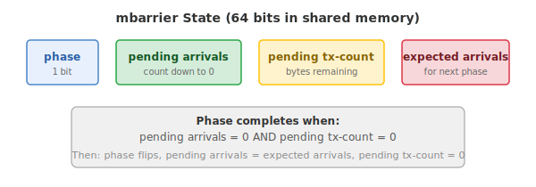
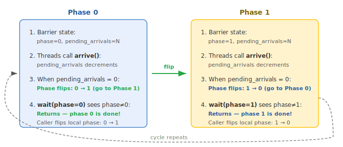

Script.mbarrier
===============

.. currentmodule:: tilus.lang.instructions.mbarrier.BarrierInstructionGroup

What is an mbarrier?
--------------------

An **mbarrier** (memory barrier) is a 64-bit synchronization object that lives in
**shared memory**. It is the primary mechanism on Hopper and Blackwell GPUs for
tracking the completion of asynchronous operations --- such as tensor core MMA and
TMA data transfers.

Unlike a traditional barrier (``__syncthreads()`` in CUDA) which simply blocks
until all threads arrive, an mbarrier can track both **thread arrivals** and
**asynchronous hardware operations** (like TMA transfers) completing in the
background.

State: mbarrier
---------------

An mbarrier stores the following state in its 64 bits:

   The internal state of an mbarrier object.

- **phase** (1 bit): the current phase of the barrier, either 0 or 1. Initialized to 0.
- **pending arrivals**: the number of arrivals still expected before this phase
  completes. Decremented by each
  :meth:`~arrive` call (and its variants :meth:`~arrive_and_expect_tx`,
  :meth:`~arrive_and_expect_tx_multicast`, :meth:`~arrive_and_expect_tx_remote`).
- **pending tx-count**: the number of bytes of asynchronous transactions still
  outstanding. Set by
  :meth:`~arrive_and_expect_tx`
  and decremented automatically by the hardware as async operations (e.g., TMA
  transfers) complete.
- **expected arrivals**: the arrival count for the *next* phase (used to reset
  pending arrivals when the phase flips).

A phase completes when **both** conditions are met:

1. ``pending arrivals = 0`` --- all participating threads have arrived.
2. ``pending tx-count = 0`` --- all tracked async transactions have completed.

When both conditions are satisfied, the hardware automatically:

- Flips the phase bit (0 |rarr| 1 or 1 |rarr| 0).
- Resets the pending arrivals to the expected arrival count.
- Resets the pending tx-count to 0.
- Wakes any threads waiting on the old phase.

.. |rarr| unicode:: U+2192

Arrive and Wait
---------------

The two fundamental operations on an mbarrier are **arrive** and **wait**:

**Arrive**

At the hardware level, a single thread executing an `mbarrier.arrive <https://docs.nvidia.com/cuda/parallel-thread-execution/#parallel-synchronization-and-communication-instructions-mbarrier-arrive>`__
instruction decrements the barrier's pending arrival count by a specified amount
(default 1). When the pending arrival count (and tx-count) reach zero, the
hardware flips the phase.

In tilus, :meth:`~arrive` is a **block-level instruction**: every thread in the
current thread group signals an arrival. For example, if the current thread group
has 32 threads and each arrives with count=1, the barrier's pending arrivals are
decremented by 32 in total. :meth:`~arrive_and_expect_tx` and
:meth:`~arrive_and_expect_tx_remote` work the same way --- each thread in the
group both arrives and adds to the expected transaction byte count.

To have only a single thread arrive (e.g., to avoid decrementing the count
multiple times), wrap the call in :meth:`~tilus.Script.single_thread`.

:meth:`~arrive_and_expect_tx_multicast` behaves differently: instead of every
thread arriving on the same barrier, one thread is **elected per target CTA** in
the ``multicast_mask``. Each elected thread arrives on the barrier at the same
shared memory offset in its assigned CTA. This requires at least 16 threads in
the current thread group. The net effect is that each target CTA's barrier
receives exactly one arrival with the specified transaction bytes.

**Wait**

At the hardware level, a thread executing `mbarrier.try_wait <https://docs.nvidia.com/cuda/parallel-thread-execution/#parallel-synchronization-and-communication-instructions-mbarrier-test-wait-try-wait>`__ with a phase value
``p`` blocks until the barrier's current phase differs from ``p``. When the
phase has flipped, all arrivals and transactions for that phase are guaranteed
complete, and it is safe to read the produced data.

In tilus, :meth:`~wait` causes **all threads in the current thread group** to
wait on the specified barrier and phase. The threads proceed together once the
phase completes.

Why Phases?
-----------

In high-performance kernels, the same mbarrier is **reused across loop
iterations** to avoid allocating a separate barrier for each iteration. The
phase bit is the minimal state that distinguishes "this iteration's completion"
from "the previous iteration's completion."

   The mbarrier phase cycle. The same barrier alternates between phase 0 and
   phase 1 across iterations.

The caller maintains a **local phase variable** that tracks which phase it
expects to complete next:

.. code-block:: python

   phase: uint32 = 0           # start expecting phase 0

   for ...:
       # ... do work, arrive ...
       self.mbarrier.wait(barrier, phase=phase)   # wait for current phase
       phase ^= 1              # flip: next iteration waits for the other phase

After ``wait`` returns, the barrier has already flipped to the next phase. By
flipping the local ``phase`` variable (``phase ^= 1``), the caller ensures the
next ``wait`` targets the correct phase.

Transaction Tracking (tx-count)
-------------------------------

For asynchronous data transfers (e.g., TMA loads), the mbarrier can also track
how many **bytes** of async work must complete before the phase is done. This is
the **tx-count** mechanism:

1. A thread calls
   :meth:`~arrive_and_expect_tx`
   to both arrive and declare how many bytes of async transactions are expected.
   This increments the pending tx-count.
2. When an async operation (e.g., :meth:`tma.global_to_shared <tilus.lang.instructions.tma.TmaInstructionGroup.global_to_shared>`) completes, the
   hardware automatically decrements the pending tx-count by the number of bytes
   transferred.
3. The phase completes only when both pending arrivals **and** pending tx-count
   reach zero.

This decouples **producers** (who launch async work and arrive) from
**consumers** (who wait for the data). The consumer does not need to know the
details of the async operations --- it simply waits on the mbarrier phase.

Usage in tilus
--------------

The typical workflow for mbarriers in a pipelined kernel is:

1. **Allocate** barriers with :meth:`~alloc`, specifying
   expected arrival counts per pipeline stage.
2. **Producers** call :meth:`~arrive` or
   :meth:`~arrive_and_expect_tx` to signal progress and
   declare expected async data transfers. The TMA engine automatically decrements
   the tx-count as transfers complete.
3. **Consumers** call :meth:`~wait` to block until the
   barrier's current phase finishes.

Use :attr:`~producer_initial_phase` (``1``) and
:attr:`~consumer_initial_phase` (``0``) as starting phase values
for multi-stage producer-consumer pipelines.

**Same-thread arrive and wait** --- all threads produce and then wait:

.. code-block:: python

   barriers = self.mbarrier.alloc(counts=[1])  # 1 arrival expected per phase
   phase: uint32 = 0                           # start expecting phase 0

   for ...:
       # signal work done, can be other instructions that will
       # trigger arrival: tcgen05.commit, etc.
       self.mbarrier.arrive(barriers[0])

       # wait for phase completion
       self.mbarrier.wait(barriers[0], phase=phase)

       # flip for next iteration
       phase ^= 1

**Separate producer and consumer warps** --- one warp loads data and arrives,
another warp waits and computes:

.. code-block:: python

   # two barrier sets: one tracks "data ready", the other tracks "slot free"
   full_barrier = self.mbarrier.alloc(counts=[1])    # signaled when data is ready
   empty_barrier = self.mbarrier.alloc(counts=[1])   # signaled when slot is free

   with self.thread_group(thread_begin=0, num_threads=32):
       # producer warp: waits for empty slot, loads data, signals full
       producer_phase: uint32 = self.mbarrier.producer_initial_phase  # 1
       for ...:
           # wait for slot to be free
           self.mbarrier.wait(empty_barrier, phase=producer_phase)
           producer_phase ^= 1
           # ... load data into shared memory ...
           self.mbarrier.arrive(full_barrier)  # signal data is ready

   with self.thread_group(thread_begin=32, num_threads=32):
       # consumer warp: waits for full data, computes, signals empty
       consumer_phase: uint32 = self.mbarrier.consumer_initial_phase  # 0
       for ...:
           # wait for data to be ready
           self.mbarrier.wait(full_barrier, phase=consumer_phase)
           consumer_phase ^= 1
           # ... compute on shared memory data ...
           self.mbarrier.arrive(empty_barrier)  # signal slot is free

For cluster-wide synchronization,
:meth:`~arrive_and_expect_tx_multicast` signals barriers
across multiple CTAs in the cluster, and
:meth:`~arrive_and_expect_tx_remote` signals a specific
peer CTA's barrier.

Instructions
------------

.. autosummary::
   :toctree: generated

   alloc
   arrive
   arrive_and_expect_tx
   arrive_and_expect_tx_multicast
   arrive_and_expect_tx_remote
   wait

.. rubric:: Attributes

.. autosummary::
   :toctree: generated

   producer_initial_phase
   consumer_initial_phase
