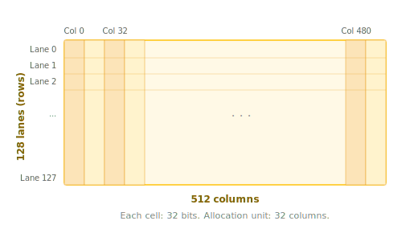

.. _tutorial_blackwell_matmul_v0:

0. A Minimal Blackwell Matmul
=============================

This first version implements a minimal but correct matrix multiplication kernel
on Blackwell GPUs. It introduces three key Blackwell features:
**Tensor Memory** (:doc:`tcgen05 </python-api/instruction-groups/tcgen05>`),
**5th-generation Tensor Cores**, and
**asynchronous barriers** (:doc:`mbarrier </python-api/instruction-groups/mbarrier>`).

The kernel is not yet fast --- we will optimize it step by step in later
versions --- but it establishes the foundation for everything that follows.

The Full Kernel
---------------

Before diving into the details, here is the complete kernel so you can see the
big picture. We will explain each part in the sections that follow.

.. literalinclude:: ../../../../examples/blackwell_matmul/matmul_v0.py
   :language: python
   :start-at: @tilus.autotune
   :end-at: self.tcgen05.dealloc(t_acc)
   :caption: BlackwellMatmulV0 --- full kernel

Block Tiling
------------

We compute :math:`C = A \times B^T` where A is (M, K) and B is (N, K).
The output matrix C is (M, N).

Each thread block is responsible for computing one ``block_m x block_n`` tile of
C. The K dimension is iterated in chunks of ``block_k``.

.. figure:: figures/v0_block_tiling.svg
   :width: 100%
   :align: center

   Block tiling of the matmul. Each thread block computes one output tile.
   The hatched regions show the full slices of A and B\ :sup:`T` that participate
   in computing the highlighted C tile.

// remove the x and = in the figure, instead, adding A x B^T = C at the bottom (centered).

Data Flow
---------

The kernel moves data through four memory levels:

.. figure:: figures/v0_data_flow.svg
   :width: 100%
   :align: center

   Data flow in the kernel: Global Memory |rarr| Shared Memory |rarr| Tensor Memory |rarr| Registers |rarr| Global Memory.

.. |rarr| unicode:: U+2192

1. **Global** |rarr| **Shared**: :meth:`~tilus.Script.copy_async` loads tiles of
   A and B from global memory into shared memory asynchronously. This uses the
   legacy async copy mechanism (Ampere-era); we will replace it with the
   hardware **TMA** engine in the next version.
2. **Shared** |rarr| **Tensor Memory**:
   :meth:`tcgen05.mma <tilus.lang.instructions.tcgen05.Tcgen05InstructionGroup.mma>`
   reads operands from shared memory and accumulates the result in tensor memory.
3. **Tensor Memory** |rarr| **Register**:
   :meth:`tcgen05.load <tilus.lang.instructions.tcgen05.Tcgen05InstructionGroup.load>`
   moves the accumulated result from tensor memory to registers.
4. **Register** |rarr| **Global**: :meth:`~tilus.Script.store_global` writes the
   final result back to global memory.

Tensor Memory (TMEM)
--------------------

**Tensor Memory** is a new memory space introduced on Blackwell (sm_100),
private to the SM's tensor cores.
It acts as a high-bandwidth accumulator for MMA operations,
avoiding the need to hold large accumulator tiles in registers.

Tensor Memory is organized as a 2D structure of **128 lanes** (rows) and
**512 columns** per CTA, with each cell being 32 bits. Memory is allocated
in units of 32 columns.

   Tensor Memory layout: 128 lanes x 512 columns, each cell 32 bits.

In tilus, the lifecycle of a tensor memory allocation is:

1. :meth:`tcgen05.alloc <tilus.lang.instructions.tcgen05.Tcgen05InstructionGroup.alloc>`
   --- allocate a :class:`~tilus.ir.tensor.TMemoryTensor` in tensor memory.
2. :meth:`tcgen05.mma <tilus.lang.instructions.tcgen05.Tcgen05InstructionGroup.mma>`
   --- use it as the accumulator in MMA operations.
3. :meth:`tcgen05.load <tilus.lang.instructions.tcgen05.Tcgen05InstructionGroup.load>`
   --- read the result out to a :class:`~tilus.ir.tensor.RegisterTensor`.
4. :meth:`tcgen05.dealloc <tilus.lang.instructions.tcgen05.Tcgen05InstructionGroup.dealloc>`
   --- free the allocation (required before the kernel exits).

For more details, see :doc:`/python-api/instruction-groups/tcgen05` and
:doc:`/programming-guides/type-system/tmemory-tensor`.

Asynchronous Barriers (mbarrier)
--------------------------------

On Blackwell, many operations are **asynchronous** --- an instruction can be
issued and completed later. We need a way to know when an async operation has
finished. This is the role of the **mbarrier** (memory barrier).

An mbarrier tracks completion through a **phase** that flips between 0 and 1:

- :meth:`mbarrier.wait(barrier, phase=p) <tilus.lang.instructions.mbarrier.BarrierInstructionGroup.wait>`
  blocks until the barrier's current phase differs from ``p``, meaning the
  tracked operations have completed.
- After each wait, the caller flips its local phase (``phase ^= 1``) to prepare
  for the next round.

In this kernel, we use an mbarrier to track when
:meth:`tcgen05.mma <tilus.lang.instructions.tcgen05.Tcgen05InstructionGroup.mma>`
+
:meth:`tcgen05.commit <tilus.lang.instructions.tcgen05.Tcgen05InstructionGroup.commit>`
have finished writing to tensor memory.

For more details, see :doc:`/python-api/instruction-groups/mbarrier`.

Data Layout: K-major
--------------------

Blackwell tensor cores
(:meth:`tcgen05.mma <tilus.lang.instructions.tcgen05.Tcgen05InstructionGroup.mma>`)
expect operands in shared memory in
one of two layouts: **MN-major** or **K-major**. In this tutorial, we use
K-major, meaning the K dimension is contiguous in memory.

Since we store both A and B as K-major:

- **A** has shape ``[M, K]`` --- K is already the last (contiguous) dimension.
- **B** has shape ``[N, K]`` --- also K-major.

However, ``tcgen05.mma`` computes :math:`D = A \times B` and expects logical
shapes ``[M, K]`` and ``[K, N]``. Since our B is ``[N, K]``, we call
``s_b.transpose()`` to present it as ``[K, N]``. This is a **view operation**
that reinterprets the layout without copying data.

Thread Groups
-------------

By default, every instruction in tilus specifies a cooperative execution by the
**entire thread block**, similar to `Triton <https://triton-lang.org/>`_.
However, efficient matrix multiplication kernels on Hopper and Blackwell
architectures require different warps to perform different jobs and collaborate
with each other asynchronously. To assign different sub-programs to different
warps, tilus introduces :doc:`thread groups </programming-guides/thread-group>`.

A thread group selects a subset of threads within the block using
:meth:`~tilus.Script.thread_group`. For example:

.. code-block:: python

    with self.thread_group(thread_begin=0, num_threads=32):
        # Only threads 0-31 (one warp) execute this
        ...

    with self.thread_group(thread_begin=32, num_threads=32):
        # Only threads 32-63 execute this
        ...

Tilus also provides shortcuts for common patterns:
:meth:`~tilus.Script.single_thread` for one thread,
:meth:`~tilus.Script.single_warp` for one warp (32 threads), and
:meth:`~tilus.Script.warp_group` for multiple warps.

In this kernel, Blackwell tensor core instructions
(:meth:`tcgen05.mma <tilus.lang.instructions.tcgen05.Tcgen05InstructionGroup.mma>`,
:meth:`tcgen05.commit <tilus.lang.instructions.tcgen05.Tcgen05InstructionGroup.commit>`)
are **warp-cooperative** --- they must be issued by exactly one warp.
We use :meth:`~tilus.Script.single_warp` to express this:

.. literalinclude:: ../../../../examples/blackwell_matmul/matmul_v0.py
   :language: python
   :start-at: with self.single_warp():
   :end-at: self.mbarrier.wait
   :dedent: 12

For more details, see :doc:`/programming-guides/thread-group`.

Walkthrough
-----------

With the key Blackwell features covered above --- tensor memory, asynchronous
barriers, K-major data layout, and thread groups --- let us now walk through the
kernel code in detail.

A tilus kernel is defined as a subclass of :class:`~tilus.Script`. The
``__init__`` method stores compile-time hyperparameters (tile sizes), and
``__call__`` describes the kernel logic. For more on the script structure, see
:doc:`/programming-guides/tilus-script`.

Kernel Setup
~~~~~~~~~~~~

.. literalinclude:: ../../../../examples/blackwell_matmul/matmul_v0.py
   :language: python
   :start-at: self.attrs.blocks
   :end-at: self.sync()
   :dedent: 8
   :caption: Kernel setup

- :attr:`self.attrs.blocks <tilus.lang.script.Attributes.blocks>` sets the grid
  dimensions --- ``ceil(M / block_m) x ceil(N / block_n)`` thread blocks.
- :attr:`self.attrs.warps <tilus.lang.script.Attributes.warps>` sets the number
  of warps per block (4 warps = 128 threads).
- ``offset_m`` and ``offset_n`` are the output tile offsets, computed from the
  block index (:attr:`~tilus.Script.blockIdx`).
- :meth:`~tilus.Script.global_view` interprets the raw pointers as 2D tensors
  with the given dtype and shape.
- :meth:`~tilus.Script.shared_tensor` allocates shared memory tiles for staging
  A and B data.
- :meth:`tcgen05.alloc <tilus.lang.instructions.tcgen05.Tcgen05InstructionGroup.alloc>`
  allocates the tensor memory accumulator.
- :meth:`mbarrier.alloc <tilus.lang.instructions.mbarrier.BarrierInstructionGroup.alloc>`
  allocates one mbarrier with an expected arrival count of 1.
- The phase variable is initialized for mbarrier tracking, and
  :meth:`~tilus.Script.sync` ensures all setup is complete before the main loop.

Main Loop
~~~~~~~~~

.. literalinclude:: ../../../../examples/blackwell_matmul/matmul_v0.py
   :language: python
   :start-at: for offset_k
   :end-at: phase ^= 1
   :dedent: 8
   :caption: Main loop

In each iteration:

- :meth:`~tilus.Script.copy_async` loads a ``block_m x block_k`` tile of A and a
  ``block_n x block_k`` tile of B from global to shared memory.
  :meth:`~tilus.Script.copy_async_wait_all` waits for all outstanding copies, and
  :meth:`~tilus.Script.sync` ensures all threads see the data.
- Within :meth:`~tilus.Script.single_warp`,
  :meth:`tcgen05.mma <tilus.lang.instructions.tcgen05.Tcgen05InstructionGroup.mma>`
  multiplies the two tiles and accumulates into tensor memory.
  ``enable_input_d=offset_k != 0`` means the first iteration computes
  :math:`D = A \times B`, and subsequent iterations compute
  :math:`D = A \times B + D`.
- :meth:`tcgen05.commit <tilus.lang.instructions.tcgen05.Tcgen05InstructionGroup.commit>`
  signals the mbarrier that the MMA has been submitted.
  :meth:`mbarrier.wait <tilus.lang.instructions.mbarrier.BarrierInstructionGroup.wait>`
  blocks until the MMA completes.
- ``phase ^= 1`` prepares for the next mbarrier cycle.

Epilogue
~~~~~~~~

.. literalinclude:: ../../../../examples/blackwell_matmul/matmul_v0.py
   :language: python
   :start-at: # load the result from tensor memory to register
   :end-at: self.tcgen05.dealloc(t_acc)
   :dedent: 8
   :caption: Epilogue

After the loop, we load the accumulator from tensor memory to registers via
:meth:`tcgen05.load <tilus.lang.instructions.tcgen05.Tcgen05InstructionGroup.load>`,
cast to float16, and write to global memory via
:meth:`~tilus.Script.store_global`. Finally, we deallocate the tensor memory
with :meth:`tcgen05.dealloc <tilus.lang.instructions.tcgen05.Tcgen05InstructionGroup.dealloc>`.

Running the Kernel
------------------

.. literalinclude:: ../../../../examples/blackwell_matmul/matmul_v0.py
   :language: python
   :start-at: def main
   :end-at: kernel_regex
   :caption: Launch, verify, and benchmark

What's Next
-----------

This kernel works but is far from optimal. The main bottleneck is the
**load path**: :meth:`~tilus.Script.copy_async` uses the legacy async copy
mechanism, which requires all threads to participate and does not leverage
the hardware's **Tensor Memory Access (TMA)** engine.

In :ref:`V1 <tutorial_blackwell_matmul_v1>`, we replace ``copy_async`` with
**TMA** loads, which offload address generation and data movement to a dedicated
hardware unit, freeing up warps for computation.

Full Source
-----------

The complete example file is located at
:download:`examples/blackwell_matmul/matmul_v0.py <../../../../examples/blackwell_matmul/matmul_v0.py>`.
