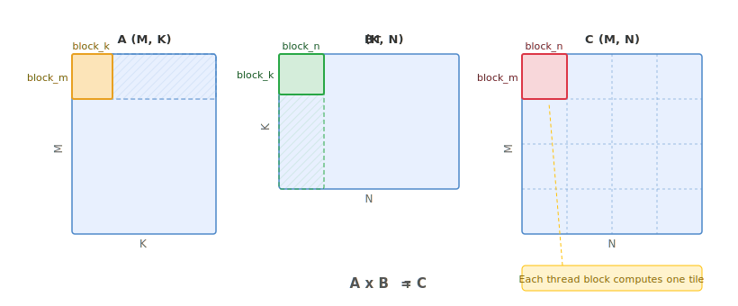
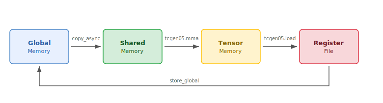

.. _tutorial_blackwell_matmul_v0:

0. A Minimal Blackwell Matmul
=============================

This first version implements a minimal but correct matrix multiplication kernel
on Blackwell GPUs. It introduces two key Blackwell features:
**Tensor Memory and 5th-generation Tensor Cores** (:doc:`tcgen05 </python-api/instruction-groups/tcgen05>`)
and **asynchronous barriers** (:doc:`mbarrier </python-api/instruction-groups/mbarrier>`).

The kernel is not yet fast --- we will optimize it step by step in later
versions --- but it establishes the foundation for everything that follows.

The Full Kernel
---------------

Before diving into the details, here is the complete kernel so you can see the
big picture. We will explain each part in the sections that follow.

.. literalinclude:: ../../../../examples/blackwell_matmul/matmul_v0.py
   :language: python
   :start-at: @tilus.autotune
   :end-at: self.tcgen05.dealloc(t_acc)
   :caption: BlackwellMatmulV0 --- full kernel

Block Tiling
------------

We compute :math:`C = A \times B^T` where A is (M, K) and B is (N, K).
The output matrix C is (M, N).

Each thread block is responsible for computing one ``block_m x block_n`` tile of
C. The K dimension is iterated in chunks of ``block_k``.

   Block tiling of the matmul. Each thread block computes one output tile.
   The hatched regions show the full slices of A and B\ :sup:`T` that participate
   in computing the highlighted C tile.

.. note::

   **Data layout: K-major.** Blackwell tensor cores expect operands in one of two
   shared memory layouts: MN-major or K-major. This tutorial uses K-major (K is
   the contiguous dimension), so A is ``[M, K]`` and B is ``[N, K]``.
   ``tcgen05.mma`` expects logical shapes ``[M, K]`` and ``[K, N]``, which is why
   we call ``s_b.transpose()`` --- a view operation that reinterprets the layout
   without copying data.

Data Flow
---------

Unlike Triton where shared memory is managed automatically, tilus gives explicit
control over data placement --- this is necessary to use Blackwell hardware
features like TMA and tcgen05. The kernel moves data through four memory levels:

   Data flow in the kernel: Global Memory |rarr| Shared Memory |rarr| Tensor Memory |rarr| Registers |rarr| Global Memory.

.. |rarr| unicode:: U+2192

1. **Global** |rarr| **Shared**: :meth:`~tilus.Script.copy_async` loads tiles of
   A and B from global memory into shared memory asynchronously. This uses the
   legacy async copy mechanism (Ampere-era); we will replace it with the
   hardware **TMA** engine in the next version.
2. **Shared** |rarr| **Tensor Memory**:
   :meth:`tcgen05.mma <tilus.lang.instructions.tcgen05.Tcgen05InstructionGroup.mma>`
   reads operands from shared memory and accumulates the result in tensor memory.
3. **Tensor Memory** |rarr| **Register**:
   :meth:`tcgen05.load <tilus.lang.instructions.tcgen05.Tcgen05InstructionGroup.load>`
   moves the accumulated result from tensor memory to registers.
4. **Register** |rarr| **Global**: :meth:`~tilus.Script.store_global` writes the
   final result back to global memory.

Tensor Memory (TMEM)
--------------------

On pre-Blackwell architectures, MMA results are accumulated in the register
file, which creates two problems: the accumulator tiles consume a large number of
registers per thread (e.g., 128 registers just for one Hopper GMMA N=256 result),
and the MMA traffic monopolizes register file bandwidth, stalling other work.
Blackwell introduces **Tensor Memory** --- a dedicated on-chip memory private to
the SM's tensor cores. By moving the accumulator into TMEM, the register file is
freed for epilogue and load instructions to run concurrently with the tensor
cores.

Tensor Memory is organized as a 2D structure of **128 lanes** (rows) and
**512 columns** per CTA, with each cell being 32 bits. Memory is allocated
in units of 32 columns.

.. figure:: /python-api/instruction-groups/figures/tmem_layout.svg
   :width: 80%
   :align: center

   Tensor Memory layout: 128 lanes x 512 columns, each cell 32 bits.

In tilus, the lifecycle of a tensor memory allocation is:

1. :meth:`tcgen05.alloc <tilus.lang.instructions.tcgen05.Tcgen05InstructionGroup.alloc>`
   --- allocate a :class:`~tilus.ir.tensor.TMemoryTensor` in tensor memory.
2. :meth:`tcgen05.mma <tilus.lang.instructions.tcgen05.Tcgen05InstructionGroup.mma>`
   --- use it as the accumulator in MMA operations.
3. :meth:`tcgen05.load <tilus.lang.instructions.tcgen05.Tcgen05InstructionGroup.load>`
   --- read the result out to a :class:`~tilus.ir.tensor.RegisterTensor`.
4. :meth:`tcgen05.dealloc <tilus.lang.instructions.tcgen05.Tcgen05InstructionGroup.dealloc>`
   --- free the allocation (required before the kernel exits).

For more details, see :doc:`/python-api/instruction-groups/tcgen05`.

Asynchronous Barriers (mbarrier)
--------------------------------

In Triton, synchronization is handled implicitly. On Blackwell, many operations
are **asynchronous** --- the instruction returns immediately and the work
completes in the background. This enables overlapping data movement with
computation, but requires explicit tracking of when operations finish. This is
the role of the **mbarrier** (memory barrier, see :doc:`/python-api/instruction-groups/mbarrier`).

An mbarrier is a **64-bit synchronization object in shared memory** that tracks
two things:

- **Pending arrivals**: how many threads still need to signal they are done.
  Each :meth:`mbarrier.arrive <tilus.lang.instructions.mbarrier.BarrierInstructionGroup.arrive>`
  call decrements this count.
- **Phase** (1 bit): flips between 0 and 1 each time a phase completes.

.. note::
   :class: margin

   mbarriers can also track **asynchronous byte transactions** (tx-count) for
   TMA transfers. We will introduce this in the next version.

A phase completes when all pending arrivals reach zero. At that point, the
hardware automatically flips the phase bit and resets the counters for the next
phase.

**Wait** checks the phase:
:meth:`mbarrier.wait(barrier, phase=p) <tilus.lang.instructions.mbarrier.BarrierInstructionGroup.wait>`
blocks until the barrier's current phase differs from ``p``. When the phase has
flipped, the tracked operations are guaranteed to have completed.

**Why flip the phase?** The same barrier is reused across loop iterations. The
phase bit distinguishes "this iteration completed" from "the previous iteration
completed." After each wait, the caller flips its local phase variable
(``phase ^= 1``) so the next wait targets the new phase:

.. code-block:: python

   phase: uint32 = 0               # start expecting phase 0
   for ...:
       self.mbarrier.wait(barrier, phase=phase)  # wait for current phase
       phase ^= 1                  # next iteration waits for the other phase

In this kernel, we use an mbarrier to track when
:meth:`tcgen05.mma <tilus.lang.instructions.tcgen05.Tcgen05InstructionGroup.mma>`
has finished writing to tensor memory. The
:meth:`tcgen05.commit <tilus.lang.instructions.tcgen05.Tcgen05InstructionGroup.commit>`
instruction makes the mbarrier track completion of all prior async tcgen05
operations --- when those operations actually complete, the hardware signals the
mbarrier by arriving on it.

Thread Groups
-------------

By default, every instruction in tilus specifies a cooperative execution by the
**entire thread block**, similar to `Triton <https://triton-lang.org/>`_.
However, efficient matrix multiplication kernels on Hopper and Blackwell
architectures require different warps to perform different jobs and collaborate
with each other asynchronously. To assign different sub-programs to different
warps, tilus introduces :doc:`thread groups </programming-guides/thread-group>`.

A thread group selects a subset of threads within the block using
:meth:`~tilus.Script.thread_group`. For example:

.. code-block:: python

    with self.thread_group(thread_begin=0, num_threads=32):
        # Only threads 0-31 (one warp) execute this
        ...

    with self.thread_group(thread_begin=32, num_threads=32):
        # Only threads 32-63 execute this
        ...

Tilus also provides shortcuts for common patterns:
:meth:`~tilus.Script.single_thread` for one thread,
:meth:`~tilus.Script.single_warp` for one warp (32 threads), and
:meth:`~tilus.Script.warp_group` for multiple warps.

In this kernel, Blackwell tensor core instructions
(:meth:`tcgen05.mma <tilus.lang.instructions.tcgen05.Tcgen05InstructionGroup.mma>`,
:meth:`tcgen05.commit <tilus.lang.instructions.tcgen05.Tcgen05InstructionGroup.commit>`)
are **warp-cooperative** --- they must be issued by exactly one warp.
We use :meth:`~tilus.Script.single_warp` to express this:

.. literalinclude:: ../../../../examples/blackwell_matmul/matmul_v0.py
   :language: python
   :start-at: with self.single_warp():
   :end-at: self.mbarrier.wait
   :dedent: 12

For more details, see :doc:`/programming-guides/thread-group`.

Walkthrough
-----------

With the key Blackwell features covered above --- tensor memory, asynchronous
barriers, K-major data layout, and thread groups --- let us now walk through the
kernel code in detail.

A tilus kernel is defined as a subclass of :class:`~tilus.Script`. The
``__init__`` method stores compile-time hyperparameters (tile sizes), and
``__call__`` describes the kernel logic. For more on the script structure, see
:doc:`/programming-guides/tilus-script`.

The ``@tilus.autotune`` decorators define a search space for compile-time
hyperparameters. Tilus benchmarks all combinations and picks the fastest
configuration automatically. For more on autotuning, see
:doc:`/programming-guides/autotuning`.

Kernel Setup
~~~~~~~~~~~~

.. literalinclude:: ../../../../examples/blackwell_matmul/matmul_v0.py
   :language: python
   :start-at: # set the number of blocks
   :end-at: self.sync()
   :dedent: 8
   :caption: Kernel setup

- :attr:`self.attrs.blocks <tilus.lang.script.Attributes.blocks>` sets the grid
  dimensions --- ``ceil(M / block_m) x ceil(N / block_n)`` thread blocks.
- :attr:`self.attrs.warps <tilus.lang.script.Attributes.warps>` sets the number
  of warps per block. Here we use 4 warps (128 threads); later versions will use
  more warps to overlap loading and computing.
- ``offset_m`` and ``offset_n`` are the output tile offsets, computed from the
  block index (:attr:`~tilus.Script.blockIdx`).
- :meth:`~tilus.Script.global_view` interprets the raw pointers as 2D tensors
  with the given dtype and shape.
- :meth:`~tilus.Script.shared_tensor` allocates shared memory tiles for staging
  A and B data.
- :meth:`tcgen05.alloc <tilus.lang.instructions.tcgen05.Tcgen05InstructionGroup.alloc>`
  allocates the tensor memory accumulator.
- :meth:`mbarrier.alloc <tilus.lang.instructions.mbarrier.BarrierInstructionGroup.alloc>`
  allocates one mbarrier with an expected arrival count of 1 --- because
  :meth:`tcgen05.commit <tilus.lang.instructions.tcgen05.Tcgen05InstructionGroup.commit>`
  will perform exactly one arrival on the barrier when the MMA completes.
- :meth:`~tilus.Script.sync` acts as a thread block barrier (like
  ``__syncthreads()`` in CUDA), ensuring all allocations are visible to every
  thread before entering the main loop.

Main Loop
~~~~~~~~~

.. literalinclude:: ../../../../examples/blackwell_matmul/matmul_v0.py
   :language: python
   :start-at: for offset_k
   :end-at: phase ^= 1
   :dedent: 8
   :caption: Main loop

In each iteration:

- :meth:`~tilus.Script.copy_async` loads a ``block_m x block_k`` tile of A and a
  ``block_n x block_k`` tile of B from global to shared memory.
  :meth:`~tilus.Script.copy_async_wait_all` waits for all outstanding copies, and
  :meth:`~tilus.Script.sync` ensures all threads see the shared memory writes
  before the MMA warp reads them.
- Within :meth:`~tilus.Script.single_warp`,
  :meth:`tcgen05.mma <tilus.lang.instructions.tcgen05.Tcgen05InstructionGroup.mma>`
  multiplies the two tiles and accumulates into tensor memory.
  ``enable_input_d=offset_k != 0`` controls whether the existing accumulator is
  used: on the first iteration, tensor memory contains uninitialized data so we
  compute :math:`D = A \times B`; on subsequent iterations, it holds the running
  sum from prior tiles so we compute :math:`D = A \times B + D`.
- :meth:`tcgen05.commit <tilus.lang.instructions.tcgen05.Tcgen05InstructionGroup.commit>`
  makes the mbarrier track completion of the preceding async MMA.
  :meth:`mbarrier.wait <tilus.lang.instructions.mbarrier.BarrierInstructionGroup.wait>`
  blocks until the MMA writes to tensor memory are complete.
- :meth:`~tilus.Script.sync` after the ``single_warp`` block ensures all threads
  reconverge before the next iteration.
- ``phase ^= 1`` flips the local phase so the next ``mbarrier.wait`` targets
  the new phase of the reused barrier.

Epilogue
~~~~~~~~

.. literalinclude:: ../../../../examples/blackwell_matmul/matmul_v0.py
   :language: python
   :start-at: # load the result from tensor memory to register
   :end-at: self.tcgen05.dealloc(t_acc)
   :dedent: 8
   :caption: Epilogue

After the loop,
:meth:`tcgen05.load <tilus.lang.instructions.tcgen05.Tcgen05InstructionGroup.load>`
moves the accumulator from tensor memory to registers, ``.to(float16)`` casts it,
and :meth:`~tilus.Script.store_global` writes the result to global memory.
Finally, :meth:`tcgen05.dealloc <tilus.lang.instructions.tcgen05.Tcgen05InstructionGroup.dealloc>`
frees the tensor memory --- all TMEM allocations must be explicitly deallocated
before the kernel exits.

Running the Kernel
------------------

``BlackwellMatmulV0()`` creates a kernel template. Compilation happens on the
first call --- parameters annotated with ``int`` (like ``n_size``, ``k_size``)
are compile-time constants, so a new value triggers JIT compilation and
autotuning. Once compiled, subsequent calls with the same compile-time values
dispatch directly to the GPU.

.. literalinclude:: ../../../../examples/blackwell_matmul/matmul_v0.py
   :language: python
   :start-at: def main
   :end-at: kernel_regex
   :caption: Launch, verify, and benchmark

What's Next
-----------

This kernel works but is far from optimal. The main bottleneck is the
**load path**: :meth:`~tilus.Script.copy_async` uses the legacy async copy
mechanism (``cp.async`` in PTX), where every thread issues its own small copy
instruction. This has high instruction overhead and does not leverage dedicated
hardware for bulk data movement.

In the next version, we replace ``copy_async`` with **TMA** (Tensor Memory
Access) loads. TMA offloads address generation and data movement to a dedicated
hardware unit --- a single TMA instruction copies an entire tile with minimal
instruction overhead, and is issued by just one warp.

Full Source
-----------

The complete example file is located at
:download:`examples/blackwell_matmul/matmul_v0.py <../../../../examples/blackwell_matmul/matmul_v0.py>`.
