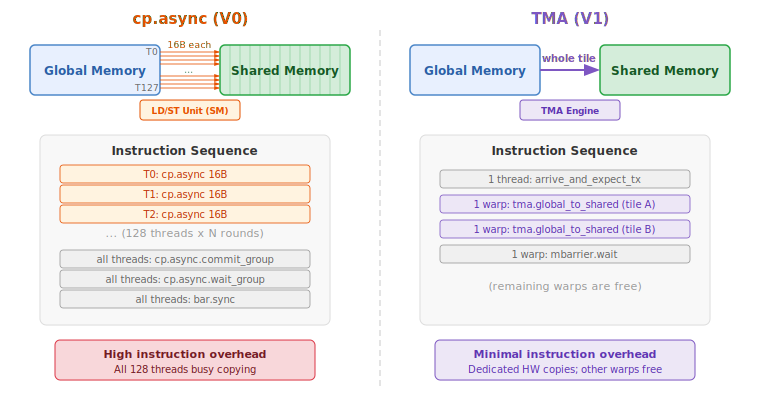

.. _tutorial_blackwell_matmul_v1:

1. TMA Loads
============

In :doc:`V0 <v0>`, we used :meth:`~tilus.Script.copy_async` to move data from
global to shared memory. That approach uses the legacy ``cp.async`` mechanism
where every thread issues its own small copy instruction, resulting in high
instruction overhead.

This version replaces ``copy_async`` with **TMA** (Tensor Memory Access) ---
a dedicated hardware engine on Hopper and Blackwell GPUs that copies
multi-dimensional tiles between global and shared memory without occupying SM
compute resources. A single TMA instruction copies an entire tile, issued by
just one warp.

This version also introduces the mbarrier **tx-count** mechanism for tracking
TMA completion, and :meth:`~tilus.Script.single_thread` for operations that
should be executed by exactly one thread.

The Full Kernel
---------------

.. literalinclude:: ../../../../examples/blackwell_matmul/matmul_v1.py
   :language: python
   :start-at: @tilus.autotune
   :end-at: self.tcgen05.dealloc(t_acc)
   :caption: BlackwellMatmulV1 --- full kernel

What Changed from V0
--------------------

The kernel structure is identical to V0 --- same block tiling, same tensor memory
accumulator, same epilogue. The only change is in the **main loop**: the data
loading and synchronization are replaced with TMA.

.. list-table::
   :header-rows: 1
   :widths: 15 40 40

   * -
     - V0
     - V1
   * - **Load**
     - :meth:`~tilus.Script.copy_async` (all threads copy)
     - :meth:`tma.global_to_shared <tilus.lang.instructions.tma.TmaInstructionGroup.global_to_shared>` (TMA engine copies)
   * - **Sync load**
     - ``copy_async_wait_all`` + ``sync``
     - ``mbarrier.wait`` with tx-count
   * - **Barriers**
     - 1 barrier (MMA only)
     - 2 barriers (TMA + MMA)

TMA: Tensor Memory Access
--------------------------

   Comparison of ``cp.async`` (V0) vs TMA (V1) for copying a tile from global
   to shared memory.

TMA is a hardware unit that asynchronously copies a multi-dimensional tile
between global and shared memory. Compared to ``cp.async``:

- **Fewer instructions**: one TMA call replaces hundreds of per-thread copy
  instructions.
- **No thread occupation**: the TMA engine operates independently; the issuing
  warp can proceed to other work.
- **Built-in address generation**: TMA handles multi-dimensional indexing
  internally, reducing register usage for address computation.

In tilus, TMA loads are issued via
:meth:`tma.global_to_shared <tilus.lang.instructions.tma.TmaInstructionGroup.global_to_shared>`.
The instruction takes a global tensor ``src``, a shared tensor ``dst``,
``offsets`` into the global tensor, and an ``mbarrier`` for completion tracking.

For more details, see :doc:`/python-api/instruction-groups/tma`.

Tracking TMA Completion with tx-count
--------------------------------------

In V0, we used mbarrier arrivals to track MMA completion. TMA introduces a
second tracking mechanism: **tx-count** (transaction byte count).

The flow works as follows:

1. A single thread calls
   :meth:`mbarrier.arrive_and_expect_tx <tilus.lang.instructions.mbarrier.BarrierInstructionGroup.arrive_and_expect_tx>`
   to declare how many bytes the upcoming TMA transfers will deliver. This both
   arrives at the barrier (decrementing pending arrivals) and increases the
   barrier's tx-count.
2. :meth:`tma.global_to_shared <tilus.lang.instructions.tma.TmaInstructionGroup.global_to_shared>`
   is issued. When the TMA engine completes the transfer, the hardware
   automatically decrements the barrier's tx-count by the number of bytes
   transferred.
3. :meth:`mbarrier.wait <tilus.lang.instructions.mbarrier.BarrierInstructionGroup.wait>`
   blocks until both pending arrivals **and** tx-count reach zero --- meaning all
   threads have arrived and all TMA data has landed in shared memory.

.. note::

   The ``transaction_bytes`` must exactly match the total bytes that will be
   transferred by the subsequent TMA calls. In our case, that is
   ``s_a.nbytes + s_b.nbytes`` --- the combined size of the two shared tiles.

single_thread
-------------

:meth:`mbarrier.arrive_and_expect_tx <tilus.lang.instructions.mbarrier.BarrierInstructionGroup.arrive_and_expect_tx>`
is a per-thread instruction --- every thread in the current thread group arrives and adds to the
tx-count. Since we only want **one** arrival and **one** tx-count increment, we
wrap it in :meth:`~tilus.Script.single_thread`:

.. literalinclude:: ../../../../examples/blackwell_matmul/matmul_v1.py
   :language: python
   :start-at: with self.single_thread():
   :end-at: )
   :dedent: 16

This ensures exactly one thread executes the ``arrive_and_expect_tx``, while the
rest of the threads skips it.

Walkthrough
-----------

The kernel setup and epilogue are identical to V0. Only the main loop changes.

Main Loop
~~~~~~~~~

.. literalinclude:: ../../../../examples/blackwell_matmul/matmul_v1.py
   :language: python
   :start-at: for offset_k
   :end-at: phase ^= 1
   :dedent: 8
   :caption: Main loop

Within :meth:`~tilus.Script.single_warp`, each iteration proceeds in two phases:

**Load phase** (TMA):

- :meth:`~tilus.Script.single_thread` ensures only one thread calls
  :meth:`mbarrier.arrive_and_expect_tx <tilus.lang.instructions.mbarrier.BarrierInstructionGroup.arrive_and_expect_tx>`,
  declaring the total expected bytes (``s_a.nbytes + s_b.nbytes``).
- Two :meth:`tma.global_to_shared <tilus.lang.instructions.tma.TmaInstructionGroup.global_to_shared>`
  calls issue the tile copies for A and B. The TMA engine transfers the data in
  the background and automatically decrements the ``tma_barrier``'s tx-count on
  completion.
- :meth:`mbarrier.wait <tilus.lang.instructions.mbarrier.BarrierInstructionGroup.wait>`
  on ``tma_barrier`` blocks until both the arrival and all TMA bytes have landed
  in shared memory.

**Compute phase** (MMA):

- :meth:`tcgen05.mma <tilus.lang.instructions.tcgen05.Tcgen05InstructionGroup.mma>`
  and :meth:`tcgen05.commit <tilus.lang.instructions.tcgen05.Tcgen05InstructionGroup.commit>`
  / :meth:`mbarrier.wait <tilus.lang.instructions.mbarrier.BarrierInstructionGroup.wait>`
  on ``mma_barrier`` --- same as V0.

Note that V1 uses **two barriers** (``tma_barrier`` and ``mma_barrier``) instead
of V0's single barrier. Both share the same ``phase`` variable since they are
used in lock-step within the same loop iteration.

What's Next
-----------

V1 is still single-stage: the warp waits for TMA to complete before issuing the
MMA, then waits for MMA before starting the next TMA. Load and compute are
fully serialized.

In :doc:`the next version <v2>`, we introduce **multi-stage software pipelining**
--- the kernel prefills multiple stages of shared memory before entering the main
loop, so that the TMA for iteration *i+1* can overlap with the MMA for
iteration *i*.

Full Source
-----------

The complete example file is located at
`examples/blackwell_matmul/matmul_v1.py <https://github.com/NVIDIA/tilus/blob/main/examples/blackwell_matmul/matmul_v1.py>`__.
