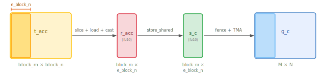

.. _tutorial_blackwell_matmul_v1:

1. TMA Loads and TMA Epilogue
=============================

V0 used :meth:`~tilus.Script.copy_async` for loading and
:meth:`~tilus.Script.store_global` for write-back. Although these are tile-level
operations in Tilus, under the hood they are lowered to per-thread ``cp.async``
and store instructions, where each thread copies only a small piece (e.g., 16
bytes). This version replaces both with **TMA** (Tensor Memory Access), a
dedicated hardware engine on Hopper and Blackwell GPUs that copies
multi-dimensional tiles between global and shared memory. A single TMA
instruction replaces hundreds of per-thread copies, and the TMA engine operates
independently without occupying SM compute resources.

The Full Kernel
---------------

.. literalinclude:: ../../../../examples/blackwell_matmul/matmul_v1.py
   :language: python
   :start-at: @tilus.autotune
   :end-at: self.tcgen05.dealloc(t_acc)
   :caption: BlackwellMatmulV1 --- full kernel

What Changed from V0
--------------------

The kernel structure is the same as V0 --- same block tiling, same tensor memory
accumulator. The main loop replaces ``copy_async`` with TMA for loading, and the
epilogue replaces ``store_global`` with a TMA-based write-back through shared
memory. This version also introduces the mbarrier **tx-count** mechanism for
tracking TMA completion, and :meth:`~tilus.Script.single_thread` for operations
that should be executed by exactly one thread.

.. list-table::
   :header-rows: 1
   :widths: 15 40 40

   * -
     - V0
     - V1
   * - **Load**
     - :meth:`~tilus.Script.copy_async` (all threads copy)
     - :meth:`tma.global_to_shared() <tilus.lang.instructions.tma.TmaInstructionGroup.global_to_shared>` (TMA engine copies)
   * - **Sync load**
     - ``copy_async_wait_all`` + ``sync``
     - ``mbarrier.wait`` with tx-count
   * - **Epilogue**
     - :meth:`~tilus.Script.store_global` (register → global)
     - TMA epilogue (tmem → register → shared → global via TMA)
   * - **Barriers**
     - 1 barrier (MMA only)
     - 2 barriers (TMA + MMA)
   * - **New instructions**
     -
     - :meth:`~tilus.lang.instructions.tma.TmaInstructionGroup.global_to_shared`,
       :meth:`~tilus.lang.instructions.mbarrier.BarrierInstructionGroup.arrive_and_expect_tx`,
       :meth:`~tilus.Script.single_thread`,
       :meth:`~tilus.lang.instructions.tcgen05.Tcgen05InstructionGroup.slice`,
       :meth:`~tilus.lang.instructions.tcgen05.Tcgen05InstructionGroup.wait_load`,
       :meth:`~tilus.Script.store_shared`,
       :meth:`~tilus.lang.instructions.fence.FenceInstructionGroup.proxy_async`,
       :meth:`~tilus.lang.instructions.tma.TmaInstructionGroup.shared_to_global`,
       :meth:`~tilus.lang.instructions.tma.TmaInstructionGroup.commit_group`,
       :meth:`~tilus.lang.instructions.tma.TmaInstructionGroup.wait_group`

TMA: Tensor Memory Access
--------------------------

.. figure:: figures/v1_cp_async_vs_tma.svg
   :width: 100%
   :align: center

   Comparison of ``cp.async`` (V0) vs TMA (V1) for copying a tile from global
   to shared memory.

TMA is a hardware unit that asynchronously copies a multi-dimensional tile
between global and shared memory. Compared to ``cp.async``:

- **Fewer instructions**: one TMA call replaces hundreds of per-thread copy
  instructions.
- **No thread occupation**: the TMA engine operates independently; the issuing
  warp can proceed to other work.
- **Built-in address generation**: TMA handles multi-dimensional indexing
  internally, reducing register usage for address computation.

In Tilus, TMA loads are issued via
:meth:`tma.global_to_shared() <tilus.lang.instructions.tma.TmaInstructionGroup.global_to_shared>`.
The instruction takes a global tensor ``src``, a shared tensor ``dst``,
``offsets`` into the global tensor, and an ``mbarrier`` for completion tracking.

For more details, see :doc:`/python-api/instruction-groups/tma`.

Tracking TMA Completion with tx-count
--------------------------------------

In V0, we used mbarrier arrivals to track MMA completion. TMA introduces a
second tracking mechanism: **tx-count** (transaction byte count).

The flow works as follows:

1. A single thread calls
   :meth:`mbarrier.arrive_and_expect_tx() <tilus.lang.instructions.mbarrier.BarrierInstructionGroup.arrive_and_expect_tx>`
   to declare how many bytes the upcoming TMA transfers will deliver. This both
   arrives at the barrier (decrementing pending arrivals) and increases the
   barrier's tx-count.
2. :meth:`tma.global_to_shared() <tilus.lang.instructions.tma.TmaInstructionGroup.global_to_shared>`
   is issued. When the TMA engine completes the transfer, the hardware
   automatically decrements the barrier's tx-count by the number of bytes
   transferred.
3. :meth:`mbarrier.wait() <tilus.lang.instructions.mbarrier.BarrierInstructionGroup.wait>`
   blocks until both pending arrivals **and** tx-count reach zero --- meaning all
   threads have arrived and all TMA data has landed in shared memory.

.. note::

   The ``transaction_bytes`` must exactly match the total bytes that will be
   transferred by the subsequent TMA calls. In our case, that is
   ``s_a.nbytes + s_b.nbytes``, the combined size of the two shared tiles
   (see :attr:`SharedTensor.nbytes <tilus.ir.SharedTensor.nbytes>`).

Thread Group with a Single Thread
----------------------------------

When
:meth:`mbarrier.arrive_and_expect_tx() <tilus.lang.instructions.mbarrier.BarrierInstructionGroup.arrive_and_expect_tx>`
is executed in a thread group, every thread in that group signals an arrival and
increases the expected tx-count on the given mbarrier. Since we only want
**one** arrival and **one** tx-count increment, we narrow the execution scope to
a single thread using :meth:`~tilus.Script.single_thread`:

.. literalinclude:: ../../../../examples/blackwell_matmul/matmul_v1.py
   :language: python
   :start-at: with self.single_thread():
   :end-at: )
   :dedent: 16

This ensures exactly one thread executes the ``arrive_and_expect_tx``, while the
rest of the threads skip it.

Walkthrough
-----------

The kernel setup is identical to V0. The main loop and epilogue change.

Main Loop
~~~~~~~~~

.. literalinclude:: ../../../../examples/blackwell_matmul/matmul_v1.py
   :language: python
   :start-at: for offset_k
   :end-at: phase ^= 1
   :dedent: 8
   :caption: Main loop

Within :meth:`~tilus.Script.single_warp`, each iteration proceeds in two phases:

**Load phase** (TMA):

- :meth:`~tilus.Script.single_thread` ensures only one thread calls
  :meth:`mbarrier.arrive_and_expect_tx() <tilus.lang.instructions.mbarrier.BarrierInstructionGroup.arrive_and_expect_tx>`,
  declaring the total expected bytes (``s_a.nbytes + s_b.nbytes``).
- Two :meth:`tma.global_to_shared() <tilus.lang.instructions.tma.TmaInstructionGroup.global_to_shared>`
  calls issue the tile copies for A and B. The TMA engine transfers the data in
  the background and automatically decrements the ``tma_barrier``'s tx-count on
  completion.
- :meth:`mbarrier.wait() <tilus.lang.instructions.mbarrier.BarrierInstructionGroup.wait>`
  on ``tma_barrier`` blocks until both the arrival and all TMA bytes have landed
  in shared memory.

**Compute phase** (MMA):

- :meth:`tcgen05.mma() <tilus.lang.instructions.tcgen05.Tcgen05InstructionGroup.mma>`
  and :meth:`tcgen05.commit() <tilus.lang.instructions.tcgen05.Tcgen05InstructionGroup.commit>`
  / :meth:`mbarrier.wait() <tilus.lang.instructions.mbarrier.BarrierInstructionGroup.wait>`
  on ``mma_barrier`` --- same as V0.

Note that V1 uses **two barriers** (``tma_barrier`` and ``mma_barrier``) instead
of V0's single barrier. Both share the same ``phase`` variable since they are
used in lock-step within the same loop iteration.

TMA Epilogue
~~~~~~~~~~~~~

.. |rarr| unicode:: U+2192

In V0, the epilogue used :meth:`~tilus.Script.store_global` to write results
directly from registers to global memory. This is simple but not optimal: each
thread stores a small piece, generating many small memory transactions.

V1 uses a **TMA epilogue** that routes data through shared memory for a bulk
TMA store. However, the full accumulator (``block_m × block_n``, e.g.,
128 × 256 in fp32) is too large to load into registers or shared memory all at
once --- it would consume too many registers and too much shared memory. Instead,
we **slice** the accumulator into narrow column strips of width ``e_block_n``
(e.g., 16, where the ``e_`` prefix stands for "epilogue") and process one strip
at a time:

   Dataflow for one epilogue slice: tensor memory |rarr| registers (with cast to
   fp16) |rarr| shared memory |rarr| global memory (via TMA). Only a ``block_m ×
   e_block_n`` slice passes through registers and shared memory at a time.

For each strip, the instruction sequence is:

1. :meth:`tcgen05.slice() <tilus.lang.instructions.tcgen05.Tcgen05InstructionGroup.slice>`
   extracts an ``e_block_n``-wide slice of the accumulator in tensor memory.
2. :meth:`tcgen05.load() <tilus.lang.instructions.tcgen05.Tcgen05InstructionGroup.load>`
   moves the slice to registers, and
   :meth:`tcgen05.wait_load() <tilus.lang.instructions.tcgen05.Tcgen05InstructionGroup.wait_load>`
   waits for the load to complete.
3. :meth:`~tilus.Script.store_shared` writes the cast result to a shared memory
   buffer.
4. :meth:`fence.proxy_async() <tilus.lang.instructions.fence.FenceInstructionGroup.proxy_async>`
   ensures the shared memory writes are visible to the TMA engine.
   ``store_shared`` writes via the **generic proxy** (the normal memory path used
   by regular load/store instructions), while ``tma.shared_to_global`` reads via
   the **async proxy** (a separate memory path used by the TMA engine). The fence
   ensures data written through one path is visible to the other.
5. :meth:`tma.shared_to_global() <tilus.lang.instructions.tma.TmaInstructionGroup.shared_to_global>`
   issues a bulk TMA transfer from shared to global memory.
6. :meth:`tma.commit_group() <tilus.lang.instructions.tma.TmaInstructionGroup.commit_group>`
   commits the pending TMA operations into a group, and
   :meth:`tma.wait_group(n=0, read=True) <tilus.lang.instructions.tma.TmaInstructionGroup.wait_group>`
   waits for the group to complete. ``n=0`` means wait for all pending groups.
   The ``read=True`` flag means we only wait for the TMA engine to finish
   **reading from shared memory** (so shared memory can be reused for the next
   slice), without waiting for the writes to global memory to be fully visible
   --- since no subsequent instruction reads the global output.

The epilogue loops over N-dimension slices of width ``e_block_n``:

.. literalinclude:: ../../../../examples/blackwell_matmul/matmul_v1.py
   :language: python
   :start-at: # TMA epilogue
   :end-before: self.tcgen05.dealloc
   :dedent: 8
   :caption: TMA epilogue

.. note::

   **TMA completion mechanisms differ by direction.** Global-to-shared TMA
   (used for loading) tracks completion via **mbarrier tx-count**.
   Shared-to-global TMA (used here in the epilogue) uses a different mechanism:
   **commit_group + wait_group**, similar to the legacy ``cp.async`` pattern.
   See `async copy completion mechanisms <https://docs.nvidia.com/cuda/parallel-thread-execution/#data-movement-and-conversion-instructions-asynchronous-copy-completion-mechanisms>`__
   and `cp.async.bulk <https://docs.nvidia.com/cuda/parallel-thread-execution/#data-movement-and-conversion-instructions-cp-async-bulk>`__
   in the PTX documentation.

Performance
-----------

TMA reduces instruction overhead for data movement, but V1 is still
single-stage: load and compute are fully serialized, so performance is similar
to V0.
The complete source is at :github:`examples/blackwell_matmul/matmul_v1.py`.

.. plot:: tutorials/matmul-blackwell/plots/plot_v1.py

   Blackwell matmul performance on B200 (M=N=K=8192, fp16). TFLOPS derived
   from NCU profiling. Peak TFLOPS estimated from cuBLAS tensor core
   utilization (96.6%).

What's Next
-----------

V1 is still single-stage: the warp waits for TMA to complete before issuing the
MMA, then waits for MMA before starting the next TMA. Load and compute are
fully serialized.

In :doc:`the next version <v2>`, we introduce **multi-stage software pipelining**
--- the kernel prefills multiple stages of shared memory before entering the main
loop, so that the TMA for iteration *i+1* can overlap with the MMA for
iteration *i*.
