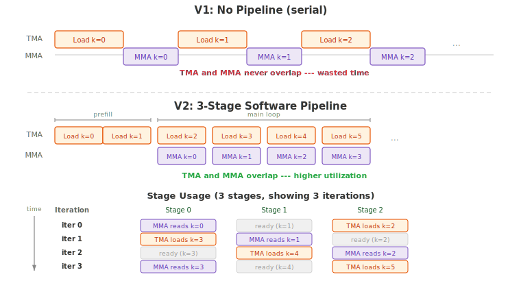

.. _tutorial_blackwell_matmul_v2:

2. Multi-Stage Software Pipelining
===================================

In :doc:`V1 <v1>`, each loop iteration first waits for TMA to finish loading data,
then issues the MMA. Load and compute are fully serialized --- the TMA engine sits
idle during MMA, and the tensor cores sit idle during TMA.

This version introduces **multi-stage software pipelining**: shared memory is
divided into multiple stages (a ring buffer), and the kernel prefills several
stages before entering the main loop. In each iteration of the main loop, the TMA
loads data for a future iteration while the MMA processes data from a previously
loaded stage. This overlaps load and compute, significantly improving utilization.

If you have used Triton, this is similar to Triton's ``num_stages`` parameter ---
but here you control the pipelining explicitly: allocating per-stage buffers,
issuing prefill loads, and managing phase tracking yourself.

The Full Kernel
---------------

.. literalinclude:: ../../../../examples/blackwell_matmul/matmul_v2.py
   :language: python
   :start-at: @tilus.autotune
   :end-at: self.tcgen05.dealloc(t_acc)
   :caption: BlackwellMatmulV2 --- full kernel

What Changed from V1
--------------------

.. list-table::
   :header-rows: 1
   :widths: 15 40 40

   * -
     - V1
     - V2
   * - **Shared memory**
     - Single stage: ``[block_m, block_k]``
     - Multi-stage ring buffer: ``[stages, block_m, block_k]``
   * - **TMA barriers**
     - 1 barrier
     - 1 barrier **per stage**
   * - **Phase tracking**
     - Single ``phase`` variable
     - Per-role ``tma_phase`` with XOR-on-wrap
   * - **Loop structure**
     - Load then compute, serial
     - Prefill stages, then overlap load and compute
   * - **New parameter**
     - ---
     - ``stages`` (autotuned: 2, 3, or 4)
   * - **New instructions**
     -
     - :meth:`~tilus.Script.range` (loop with unroll hint)

Software Pipelining
-------------------

   Top: V1 serializes load and compute. Bottom: V2 overlaps them using a
   multi-stage pipeline.

The idea is simple: if we have ``S`` stages of shared memory, we can have up to
``S - 1`` TMA loads in flight while one stage is being consumed by MMA. The
kernel proceeds in two phases:

1. **Prefill** --- Before the main loop, load the first ``S - 1`` stages via TMA.
   These loads run asynchronously; we do not wait for them yet.
2. **Main loop** --- Each iteration does three things:

   - **Preload**: issue a TMA load into the next free stage (``preload_stage``).
   - **Wait**: wait for the current stage's TMA to complete
     (``tma_barriers[current_stage]``).
   - **Compute**: run MMA on the current stage's data.

   After each iteration, both ``current_stage`` and ``preload_stage`` advance
   modulo ``stages``, cycling through the ring buffer.

Multi-Stage Shared Memory
-------------------------

In V1, shared tensors had shape ``[block_m, block_k]`` --- a single buffer that
was overwritten every iteration. In V2, shared tensors gain a leading stage
dimension:

.. code-block:: python

   s_a = self.shared_tensor(dtype=float16, shape=[self.stages, self.block_m, self.block_k])
   s_b = self.shared_tensor(dtype=float16, shape=[self.stages, self.block_n, self.block_k])

Each stage ``s_a[i]`` / ``s_b[i]`` is an independent buffer. TMA writes to one
stage while MMA reads from another, without conflicts.

Per-Stage Barriers and Phase Tracking
-------------------------------------

Each stage has its own mbarrier to track TMA completion independently:

.. code-block:: python

   tma_barriers = self.mbarrier.alloc(counts=[1 for _ in range(self.stages)])
   tma_phase: uint32 = 0
   mma_phase: uint32 = 0

Instead of tracking a separate phase for each stage's barrier, we use a single
**per-role** phase variable. After each iteration, the stage index advances
through the ring buffer. When the stage index wraps back to 0 (completing a full
cycle through all stages), the phase flips via XOR:

.. code-block:: python

   current_stage = (current_stage + 1) % self.stages
   tma_phase ^= (current_stage == 0)   # flip when wrapping to stage 0

This works because each barrier sees one ``wait`` per cycle through the ring
buffer. After a full cycle (``stages`` iterations), every barrier has been waited
on once, and the next wait on the same barrier needs the opposite phase. The XOR
flips the phase exactly at that point.

The MMA barrier remains a single barrier (as in V1) since MMA operations are
still serialized. Its phase flips every iteration (``mma_phase ^= 1``).

Loop Unrolling
--------------

The main loop uses :meth:`self.range() <tilus.Script.range>` with
``unroll=self.stages`` instead of Python's ``range()``:

.. code-block:: python

   for offset_k in self.range(0, k_size, self.block_k, unroll=self.stages):

Both Python's ``range()`` and :meth:`~tilus.Script.range` are lowered to the
same loop statement internally. The difference is that ``self.range`` provides
additional control --- here the ``unroll`` hint instructs the compiler to unroll
the loop body by the number of stages. Loop unrolling is important for pipelined
kernels because the stage index
(``current_stage``, ``preload_stage``) cycles modulo ``stages`` --- with
unrolling, the compiler can resolve these indices to constants, eliminating
modular arithmetic and enabling more efficient code generation.

Walkthrough
-----------

Prefill
~~~~~~~

.. literalinclude:: ../../../../examples/blackwell_matmul/matmul_v2.py
   :language: python
   :start-at: for i in range(self.stages - 1)
   :end-before: self.sync()
   :dedent: 8
   :caption: Prefill: load the first stages - 1 tiles

Before the main loop, the first ``stages - 1`` TMA loads are issued without
waiting. Each iteration loads into stage ``i`` and signals ``tma_barriers[i]``.
After the prefill, ``self.sync()`` ensures all threads have issued their TMA
requests before entering the main loop.

Main Loop
~~~~~~~~~

.. literalinclude:: ../../../../examples/blackwell_matmul/matmul_v2.py
   :language: python
   :start-at: current_stage
   :end-at: self.sync()
   :dedent: 8
   :caption: Main loop: overlap preload and compute

In each iteration:

- **Preload** (into ``preload_stage``):
  :meth:`mbarrier.arrive_and_expect_tx() <tilus.lang.instructions.mbarrier.BarrierInstructionGroup.arrive_and_expect_tx>`
  and :meth:`tma.global_to_shared() <tilus.lang.instructions.tma.TmaInstructionGroup.global_to_shared>`
  issue TMA loads for a future K-tile into the next free stage. This runs
  asynchronously --- the TMA engine works in the background.

- **Wait** (on ``current_stage``):
  :meth:`mbarrier.wait() <tilus.lang.instructions.mbarrier.BarrierInstructionGroup.wait>`
  blocks until the current stage's TMA data has arrived. The phase comes from
  the per-role ``tma_phase`` variable.

- **Compute** (from ``current_stage``):
  :meth:`tcgen05.mma() <tilus.lang.instructions.tcgen05.Tcgen05InstructionGroup.mma>`
  reads ``s_a[current_stage]`` and ``s_b[current_stage]``, accumulating into the
  tensor memory accumulator.

After the MMA,
:meth:`tcgen05.commit() <tilus.lang.instructions.tcgen05.Tcgen05InstructionGroup.commit>`
and :meth:`mbarrier.wait() <tilus.lang.instructions.mbarrier.BarrierInstructionGroup.wait>`
on the MMA barrier ensure the MMA completes before the next iteration.

Finally, the stage indices advance modulo ``stages``, and the per-role phase
flips when the stage wraps back to 0:

.. code-block:: python

   preload_stage = (preload_stage + 1) % self.stages   # next free stage
   current_stage = (current_stage + 1) % self.stages   # next stage to consume
   tma_phase ^= (current_stage == 0)                   # flip phase on wrap
   mma_phase ^= 1

Performance
-----------

Multi-stage pipelining overlaps TMA loads with MMA compute, more than
doubling throughput compared to V1.
The complete source is at :github:`examples/blackwell_matmul/matmul_v2.py`.

.. plot:: tutorials/matmul-blackwell/plots/plot_v2.py

   Blackwell matmul performance on B200 (M=N=K=8192, fp16). TFLOPS derived
   from NCU profiling. Peak TFLOPS estimated from cuBLAS tensor core
   utilization (96.6%).

What's Next
-----------

V2 overlaps TMA loads with MMA compute across iterations, but there is still a
limitation: each iteration runs one MMA and must wait for it to complete
(via ``tcgen05.commit`` + ``mbarrier.wait``) before issuing the next. The MMA
pipeline depth is effectively 1 --- no in-flight MMAs overlap.

In :doc:`the next version <v3>`, we separate the load and compute into
**different thread groups**: a dedicated TMA warp and a dedicated MMA warp. With separate warps, the
MMA warp can issue its next MMA immediately after the previous one without
waiting for the TMA warp, and vice versa. This enables true parallelism between
TMA and MMA, with the two warps progressing independently and synchronizing only
through mbarriers.
