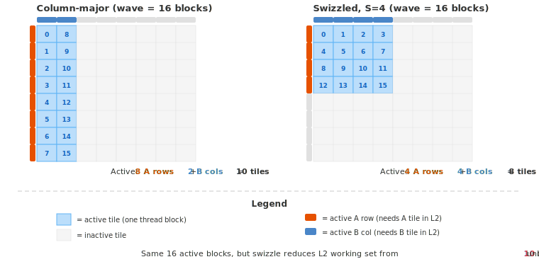
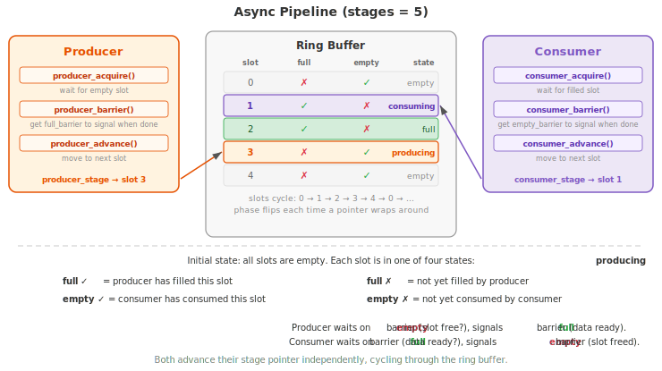

.. _tutorial_blackwell_matmul_v4:

4. Tile Rasterization, Pipeline Abstraction, and TMA Epilogue
=============================================================

:doc:`V3 <v3>` introduced warp specialization with separate TMA and MMA warps.
This version adds three improvements:

1. **Tile rasterization** --- reorder tile assignments so that consecutive thread
   blocks process tiles that share B columns, improving L2 cache reuse.  
2. **Pipeline abstraction** --- encapsulate the producer-consumer barrier logic
   from V3 into a reusable ``Pipeline`` class using ``tilus.Class``, making it
   easy to add more pipelines as the kernel grows (e.g., separate TMA and MMA
   pipelines in later versions).
3. **TMA epilogue** --- store results back to global memory via shared memory and
   TMA, instead of the direct ``store_global`` used in previous versions.

The Full Kernel
---------------

.. literalinclude:: ../../../../examples/blackwell_matmul/matmul_v4.py
   :language: python
   :start-at: class Pipeline
   :end-at: self.tcgen05.dealloc(t_acc)
   :caption: BlackwellMatmulV4 --- full kernel (including Pipeline class)

Tile Rasterization
------------------

In matmul, each output tile (m, n) needs a row-strip of A (row ``m``) and a
column-strip of B (column ``n``). A rows are unique per tile, but B columns are
**shared across all tiles in the same N-column**. This means B data loaded by
one tile can be reused by other tiles that share the same N-column --- if the
data is still in L2 cache.

The question is: **how do we order the tiles so that the GPU's L2 cache is used
effectively?** The key idea is to minimize the **working set** --- the number
of distinct A rows and B columns that must be in L2 simultaneously for the
currently active thread blocks.

   An 8 × 8 tile grid with a wave of 16 active blocks (blue cells).
   Orange bars on the left mark active A rows; blue bars on top mark active B
   columns. Swizzle achieves a smaller L2 working set (8 vs 10 tiles) for the
   same number of active blocks.

**A concrete example.** Consider an 8 × 8 grid of tiles with
``block_m = block_n = 128`` and K = 8192. Each A row-strip and each B
column-strip is 128 × 8192 in fp16 = **2 MB**.

Suppose the GPU can run 16 thread blocks concurrently (one *wave*). With
**column-major** ordering (the naive 2D grid from V3), ``blockIdx.x`` walks
down M first, so the 16 active blocks fill columns 0 and 1 completely (8 rows
each). As shown in the figure:

- **Active A rows**: 8 (all rows touched). Working set: **8 × 2 MB = 16 MB**.
- **Active B columns**: 2 (cols 0--1). Working set: **2 × 2 MB = 4 MB**.
- **Total L2 working set: 20 MB** (10 unique tiles).

With **swizzled** ordering (``swizzle_size = 4``), the same 16 blocks are
mapped to rows 0--3 of columns 0--3 --- a compact 4 × 4 square in the
top-left of the grid:

- **Active A rows**: 4 (rows 0--3 only). Working set: **4 × 2 MB = 8 MB**.
- **Active B columns**: 4 (cols 0--3). Working set: **4 × 2 MB = 8 MB**.
- **Total L2 working set: 16 MB** (8 unique tiles) --- **20% smaller**.

The reduction comes from balancing A and B: column-major packs all 8 rows into
2 columns (8 + 2 = 10 tiles), while swizzle distributes the same 16 blocks
across 4 rows and 4 columns (4 + 4 = 8 tiles). Fewer unique tiles in L2 means
higher hit rates and less off-chip memory traffic.

Formulation
~~~~~~~~~~~

Given a grid of ``num_m_blocks`` × ``num_n_blocks`` tiles and a
``swizzle_size``, the swizzled mapping works as follows:

1. Divide the N-columns into groups of ``swizzle_size``:
   group ``group_idx`` covers columns
   ``[group_idx * swizzle_size, group_idx * swizzle_size + swizzle_size)``.
2. Within each group, the tile shape is ``[num_m_blocks, swizzle_size]``, and
   tiles are assigned in **row-major** order:
   ``(m_block=0, n_block=0), (m_block=0, n_block=1), ...,
   (m_block=1, n_block=0), ...``

This makes consecutive thread blocks touch nearby rows and columns, producing a
more compact active region in the grid. The ``swizzle_size`` controls the
trade-off between A and B working sets: a larger value keeps more B columns
active (increasing B working set) but fewer A rows active (decreasing A working
set). The optimal value depends on the problem size and L2 cache capacity, so
it is autotuned.

Implementation
~~~~~~~~~~~~~~

The grid is launched as 1D, and ``compute_block_coord`` remaps each
``blockIdx.x`` to the swizzled (m, n) coordinates:

.. literalinclude:: ../../../../examples/blackwell_matmul/matmul_v4.py
   :language: python
   :start-at: num_m_blocks = cdiv
   :end-at: offset_n
   :dedent: 8
   :caption: 1D grid launch with swizzled tile coordinates

The mapping logic:

.. literalinclude:: ../../../../examples/blackwell_matmul/matmul_v4.py
   :language: python
   :start-at: def compute_block_coord
   :end-at: return m_block, n_block
   :dedent: 4
   :caption: Tile rasterization with swizzle grouping

When ``num_n_blocks`` is not divisible by ``swizzle_size``, the last group has
fewer than ``swizzle_size`` columns. The code handles this by computing
``last_group_width`` (the remainder) and using it as the divisor for tiles in
the last group, ensuring correct (m_block, n_block) mapping.

.. hint::

   Integer division and modulo are expensive on GPUs. When the divisor is a
   compile-time constant (like ``swizzle_size``), the compiler converts division
   into a mul + shift automatically, so normal ``//`` and ``%`` are fine. For
   non-constant divisors, the NVIDIA compiler falls back to floating-point
   arithmetic with int-to-float and float-to-int conversions, which is slow.
   For **grid-constant** divisors (like ``tiles_per_group``, which is the same
   for all thread blocks but not known at compile time),
   :meth:`~tilus.Script.fast_divmod` implements the fast divmod algorithm using
   integer mul + shift, precomputing the magic number once per grid launch.

Pipeline Abstraction
--------------------

On Blackwell, mbarriers are the fundamental mechanism for tracking completion of
asynchronous work, and shared memory (or tensor memory) serves as the buffer for
data in transit. When the producer and consumer operate at different speeds ---
which is always the case in practice --- we need a **pipeline** to decouple them.

A pipeline has three components:

1. **Producer** --- generates data and writes it into a buffer slot when one is
   available.
2. **Consumer** --- reads data from a buffer slot when one is filled.
3. **Ring buffer** --- a fixed number of slots (``stages``) that the producer and
   consumer cycle through independently.

Each slot has two mbarriers:

- **full_barrier** --- signaled when the producer has filled the slot. The
  consumer waits on this.
- **empty_barrier** --- signaled when the consumer has consumed the slot. The
  producer waits on this.

The producer and consumer each maintain a **stage pointer** (which slot they are
currently working on) and a **phase variable** (for the mbarrier of their current
slot). Both advance through the ring buffer independently, synchronized only by
the mbarrier signals.

   The Pipeline with 5 stages. The producer is filling slot 3; the consumer is
   consuming slot 1. Slots 2 is full (waiting to be consumed); slots 0 and 4
   are empty (waiting to be filled). The ✓/✗ marks indicate whether each
   slot's full/empty mbarrier has completed.

In V3, we managed all this state manually (barriers, phases, stage indices). The
``Pipeline`` class below encapsulates the bookkeeping into a clean API. Note that
this is not a built-in part of tilus --- it is constructed from existing
instructions (``mbarrier.alloc``, ``mbarrier.wait``, etc.) as a user-level
helper. You can always manage the mbarriers manually as in V3 if you prefer.

.. literalinclude:: ../../../../examples/blackwell_matmul/matmul_v4.py
   :language: python
   :start-at: class Pipeline
   :end-before: @tilus.autotune
   :caption: Pipeline class

The ``Pipeline`` class inherits from ``tilus.Class``, which works like
:class:`~tilus.Script` but for helper objects that are not kernels themselves.
It can allocate barriers, shared tensors, and use all tilus instructions.

The usage in the kernel becomes straightforward:

.. code-block:: python

   tma_pipe = Pipeline(stages)

   # TMA warp (producer)
   tma_pipe.producer_acquire()          # wait for empty slot
   # ... issue TMA loads with tma_pipe.producer_barrier() ...
   tma_pipe.producer_advance()          # move to next stage

   # MMA warp (consumer)
   tma_pipe.consumer_acquire()          # wait for filled slot
   # ... issue MMA ...
   self.tcgen05.commit(mbarrier=tma_pipe.consumer_barrier())  # signal slot consumed
   tma_pipe.consumer_advance()          # move to next stage

This pattern is reusable: later versions add a second pipeline (``mma_pipe``)
between the MMA and epilogue stages, using the same ``Pipeline`` class.

TMA Epilogue
------------

In V0--V3, the epilogue used :meth:`~tilus.Script.store_global` to write
results directly from registers to global memory. This is simple but not
optimal: each thread stores a small piece, generating many small memory
transactions.

V4 uses a **TMA epilogue** that routes data through shared memory for a bulk
TMA store. However, the full accumulator (``block_m × block_n``, e.g.,
128 × 256 in fp32) is too large to load into registers or shared memory all at
once --- it would consume too many registers and too much shared memory. Instead,
we **slice** the accumulator into narrow column strips of width ``e_block_n``
(e.g., 16, where the ``e_`` prefix stands for "epilogue") and process one strip
at a time:

.. figure:: figures/v4_tma_epilogue.svg
   :width: 100%
   :align: center

   Dataflow for one epilogue slice: tensor memory → registers (with cast to
   fp16) → shared memory → global memory (via TMA). Only a ``block_m ×
   e_block_n`` slice passes through registers and shared memory at a time.

For each strip, the instruction sequence is:

1. :meth:`tcgen05.slice <tilus.lang.instructions.tcgen05.Tcgen05InstructionGroup.slice>`
   extracts an ``e_block_n``-wide slice of the accumulator in tensor memory.
2. :meth:`tcgen05.load <tilus.lang.instructions.tcgen05.Tcgen05InstructionGroup.load>`
   moves the slice to registers, and
   :meth:`tcgen05.wait_load <tilus.lang.instructions.tcgen05.Tcgen05InstructionGroup.wait_load>`
   waits for the load to complete.
3. :meth:`~tilus.Script.store_shared` writes the cast result to a shared memory
   buffer.
4. :meth:`fence.proxy_async <tilus.lang.instructions.fence.FenceInstructionGroup.proxy_async>` ensures the shared memory writes are
   visible to the TMA engine.
5. :meth:`tma.shared_to_global <tilus.lang.instructions.tma.TmaInstructionGroup.shared_to_global>`
   issues a bulk TMA transfer from shared to global memory.
6. :meth:`tma.commit_group <tilus.lang.instructions.tma.TmaInstructionGroup.commit_group>`
   commits the pending TMA operations into a group, and
   :meth:`tma.wait_group(n=0, read=True) <tilus.lang.instructions.tma.TmaInstructionGroup.wait_group>`
   waits for the group to complete. The ``read=True`` flag means we only wait
   for the TMA engine to finish **reading from shared memory** (so shared memory
   can be reused for the next slice), without waiting for the writes to global
   memory to be fully visible --- since no subsequent instruction reads the
   global output.

The epilogue loops over N-dimension slices of width ``e_block_n``:

.. literalinclude:: ../../../../examples/blackwell_matmul/matmul_v4.py
   :language: python
   :start-at: # TMA epilogue
   :end-before: self.tcgen05.dealloc
   :dedent: 8
   :caption: TMA epilogue

.. note::

   **TMA completion mechanisms differ by direction.** Global-to-shared TMA
   (used in V1--V4 for loading) tracks completion via **mbarrier tx-count**.
   Shared-to-global TMA (used here in the epilogue) uses a different mechanism:
   **commit_group + wait_group**, similar to the legacy ``cp.async`` pattern.
   See `async copy completion mechanisms <https://docs.nvidia.com/cuda/parallel-thread-execution/#data-movement-and-conversion-instructions-asynchronous-copy-completion-mechanisms>`__
   and `cp.async.bulk <https://docs.nvidia.com/cuda/parallel-thread-execution/#data-movement-and-conversion-instructions-cp-async-bulk>`__
   in the PTX documentation.

   The ``fence.proxy_async(space="shared")`` before the TMA store is required
   because ``store_shared`` writes via the **generic proxy**, while
   ``tma.shared_to_global`` reads via the **async proxy**. The fence ensures
   the generic proxy writes are visible to the async proxy. See
   :doc:`/python-api/instruction-groups/fence` for details.

Walkthrough
-----------

The kernel structure is the same as V3 (TMA warp + MMA warp), but now using
the ``Pipeline`` class and the new epilogue.

Setup
~~~~~

.. literalinclude:: ../../../../examples/blackwell_matmul/matmul_v4.py
   :language: python
   :start-at: num_m_blocks = cdiv
   :end-at: flush_barrier = self.mbarrier
   :dedent: 8
   :caption: Kernel setup

Key differences from V3:

- The grid is 1D: ``blocks = num_m_blocks * num_n_blocks``.
- ``compute_block_coord`` maps the linear index to swizzled (m, n) coordinates.
- ``Pipeline(stages)`` replaces manual barrier/phase/stage management.
- ``e_block_n`` controls the epilogue slice width (autotuned).

TMA and MMA Warps
~~~~~~~~~~~~~~~~~

.. literalinclude:: ../../../../examples/blackwell_matmul/matmul_v4.py
   :language: python
   :start-at: with self.thread_group(thread_begin=0
   :end-at: self.mbarrier.wait(flush_barrier
   :dedent: 8
   :caption: TMA warp and MMA warp

The logic is identical to V3, but expressed through the Pipeline API:
``producer_acquire`` / ``producer_barrier`` / ``producer_advance`` for the TMA
warp, and ``consumer_acquire`` / ``consumer_barrier`` / ``consumer_advance``
for the MMA warp.

What's Next
-----------

V4 is a well-optimized single-CTA kernel. To push performance further, we need
to look beyond the single thread block.

In the next version, we introduce **CLC** (Cluster Launch Control) for persistent
kernels --- each CTA processes multiple output tiles dynamically via hardware
scheduling, avoiding kernel launch overhead. We also add a **pipelined
epilogue** and expand to **4 warp roles** (TMA, MMA, scheduler, epilogue).

Full Source
-----------

The complete example file is located at
`examples/blackwell_matmul/matmul_v4.py <https://github.com/NVIDIA/tilus/blob/main/examples/blackwell_matmul/matmul_v4.py>`__.
