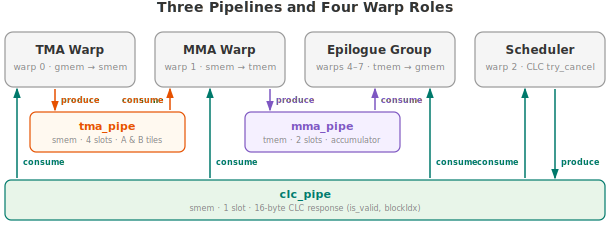

.. _tutorial_blackwell_matmul_v5:

5. CLC Persistent Kernel and Pipelined Epilogue
================================================

Our goal throughout this tutorial series has been to keep the tensor core
pipeline busy. V4 does this well *within* a single tile --- TMA and MMA run on
separate warps, and multiple MMAs are in flight. But zoom out to the full
kernel, and the tensor core is idle for significant stretches.

Each CTA has a **prologue** (allocate register file, shared memory, and tensor
memory; initialize pipelines and barriers) and an **epilogue** (read the
accumulator from tensor memory and write the result to global memory). Both sit
on the critical path, and the tensor core does nothing during either phase.
Making matters worse, efficient tensor core utilization requires large tile
sizes, which means we typically launch only **one CTA per SM** --- there is no
other CTA on the same SM to fill the gap while the first one is setting up or
writing back.

The question is: **how do we keep the tensor core pipeline busy while moving
the prologue and epilogue off the critical path?**

Blackwell introduces **Cluster Launch Control (CLC)**, a hardware mechanism that
lets a running CTA **cancel** an unscheduled thread block cluster and take over
its work. The kernel launches the full grid (one cluster per output tile), but
instead of each CTA computing one tile and exiting, a CTA that finishes its MMA
computation can immediately cancel a pending cluster, obtain the cancelled
cluster's ``blockIdx``, and start computing the next tile --- all without
tearing down and reallocating resources. The prologue cost is paid once; every
subsequent tile reuses the already-allocated register file, shared memory, and
tensor memory. As a bonus, CLC naturally load-balances across SMs: faster SMs
cancel more clusters and process more tiles, avoiding the tail effect when the
grid is not evenly divisible by the number of SMs.

CLC also solves the epilogue problem. Because the CTA stays alive across tiles,
we can hand the epilogue to a dedicated warp group that writes tile N's results
to global memory while the MMA warp has already moved on to tile N+1's
computation. The tensor core never stalls waiting for the epilogue to finish.

This tutorial covers the two optimizations in turn:

1. **CLC persistent kernel** --- how to use Blackwell's cluster launch control
   to cancel a pending cluster, obtain the next tile assignment, and loop.
2. **Pipelined epilogue** --- how to add a dedicated epilogue warp group so that
   epilogue and MMA overlap across tiles.

The Full Kernel
---------------

.. literalinclude:: ../../../../examples/blackwell_matmul/matmul_v5.py
   :language: python
   :start-at: class Pipeline
   :end-at: self.tcgen05.dealloc(t_acc)
   :caption: BlackwellMatmulV5 --- full kernel (including Pipeline class)

What Changed from V4
--------------------

.. list-table::
   :header-rows: 1
   :widths: 15 40 40

   * -
     - V4
     - V5
   * - **Tile scheduling**
     - 1 CTA = 1 tile (non-persistent)
     - CLC persistent: each CTA processes multiple tiles
   * - **Warp roles**
     - TMA (warp 0) + MMA (warp 1), 4 warps total
     - TMA + MMA + Scheduler + Epilogue, 8 warps total
   * - **Epilogue**
     - Sequential after ``sync()``, all warps participate
     - Dedicated warp group (warps 4--7), runs in parallel with MMA
   * - **Pipelines**
     - 1: ``tma_pipe`` (TMA |rarr| MMA) + flush barrier
     - 3: ``tma_pipe`` + ``mma_pipe`` (MMA |rarr| epilogue) + ``clc_pipe``
   * - **Accumulator**
     - Single: ``[block_m, block_n]``
     - Multi-stage: ``[mma_stages, block_m, block_n]``
   * - **Autotuning**
     - ``stages`` (shared for TMA pipeline)
     - ``tma_stages`` + ``mma_stages`` (independent)

.. |rarr| unicode:: U+2192

CLC Persistent Kernel
---------------------

What CLC Provides
~~~~~~~~~~~~~~~~~

Traditionally, persistent kernels use a software work queue (e.g., an atomic
counter in global memory) to assign tiles. This works but adds contention on the
atomic and requires careful ordering to maintain cache locality.

**Cluster Launch Control (CLC)** is a Blackwell hardware feature that provides a
hardware-managed work queue. The programming model is elegant:

- The kernel is launched with the **full grid size** (one CTA per tile), just
  like a non-persistent kernel.
- The hardware scheduler starts launching CTAs as usual. But at any point, a
  running CTA can **cancel** a not-yet-launched CTA and steal its ``blockIdx``.
- ``clc.try_cancel`` is an async operation: it sends a cancellation request to
  the hardware and writes a 16-byte response into shared memory, tracked by an
  mbarrier (the same tx-count mechanism as TMA).
- ``clc.query_response`` decodes the response: ``(is_valid, new_blockIdx)``.
  If ``is_valid`` is True, the CTA processes the stolen tile. If False, all
  tiles have been processed (or a higher-priority kernel needs the SM), and the
  CTA should exit.

This gives the best of both worlds: the grid size reflects the problem size
(so the hardware knows the total work), while the execution is persistent and
load-balanced.

CLC in the Kernel
~~~~~~~~~~~~~~~~~

The CLC mechanism uses a dedicated **scheduler warp** (warp 2) and a
``clc_pipe`` pipeline to distribute tile assignments to all other warps.

The scheduler warp is the **producer** of ``clc_pipe``:

.. literalinclude:: ../../../../examples/blackwell_matmul/matmul_v5.py
   :language: python
   :start-at: with self.single_warp(2):  # scheduler
   :end-at: break
   :dedent: 8
   :caption: Scheduler warp (CLC producer)

Each iteration:

1. ``clc_pipe.producer_acquire()`` waits for the current slot to be empty
   (initially all slots are empty, so the first iteration proceeds immediately).
2. :meth:`~tilus.lang.instructions.mbarrier.BarrierInstructionGroup.arrive_and_expect_tx`
   declares that 16 bytes will arrive on the barrier --- this is the size of the
   CLC response that ``try_cancel`` will write to shared memory.
3. :meth:`clc.try_cancel <tilus.lang.instructions.clc.ClusterLaunchControlInstructionGroup.try_cancel>`
   sends the cancellation request to the CLC hardware. The hardware writes the
   16-byte response to ``s_clc_response`` and signals the barrier.
4. The scheduler itself also consumes the response (via ``query_clc_response``)
   to learn whether to continue or exit.

Every other warp is a **consumer** of ``clc_pipe``:

.. literalinclude:: ../../../../examples/blackwell_matmul/matmul_v5.py
   :language: python
   :start-at: def query_clc_response
   :end-at: return is_valid, new_blockIdx
   :dedent: 4
   :caption: ``query_clc_response`` --- consuming the CLC response

When any other warp (TMA, MMA, or epilogue) needs to know whether there is
another tile to process and what its block index is, it calls
``query_clc_response``. Inside this helper:

- ``consumer_acquire`` waits for the current ``clc_pipe`` slot to be filled ---
  i.e., the scheduler has produced a CLC response.
- :meth:`clc.query_response <tilus.lang.instructions.clc.ClusterLaunchControlInstructionGroup.query_response>`
  decodes the response to extract ``(is_valid, new_blockIdx)``.
- :meth:`~tilus.lang.instructions.mbarrier.BarrierInstructionGroup.arrive_and_expect_tx`
  on the consumer barrier signals that this warp has finished reading. Once all
  consumers have signaled, the scheduler is free to reuse this slot for the next
  query.

Every warp that reads the CLC response is a consumer of ``clc_pipe`` --- this
includes the scheduler itself (which needs the result to decide whether to
exit). The consumers and their thread counts are:

.. list-table::
   :header-rows: 1
   :widths: 20 20 20

   * - Consumer warp(s)
     - Threads
     - Role
   * - 0
     - 32
     - TMA
   * - 1
     - 32
     - MMA
   * - 2
     - 32
     - Scheduler (also producer)
   * - 4, 5, 6, 7
     - 128
     - Epilogue
   * - **Total**
     - **224**
     -

Hence ``consumer_arrive_count=224``: all 224 threads must arrive before the
scheduler can reuse the response buffer slot.

Persistent Loop Structure
~~~~~~~~~~~~~~~~~~~~~~~~~

Each thread group runs a ``while True`` loop. The first tile comes from
``blockIdx.x`` (the CTA's original assignment). Subsequent tiles come from CLC:

.. code-block:: python

   # First tile: use the CTA's original blockIdx
   m_block, n_block = self.compute_block_coord(self.blockIdx.x, ...)
   while True:
       # ... process tile (TMA loads / MMA / epilogue) ...

       is_valid, new_blockIdx = self.query_clc_response(s_clc_response, clc_pipe)
       if not is_valid:
           break  # no more tiles, exit

       # Next tile: use the stolen blockIdx
       m_block, n_block = self.compute_block_coord(new_blockIdx.x, ...)

Pipelined Epilogue
------------------

In V4, the epilogue runs **after** the MMA loop. All warps join a ``sync()``
barrier, then every thread participates in the epilogue: load from tensor
memory, cast, store to shared memory, TMA to global memory. During this time,
the tensor core pipeline sits idle --- there is no MMA work to do because the
epilogue is blocking all warps. In a persistent kernel, this matters even more:
the epilogue of tile N and the MMA of tile N+1 could overlap, but V4's
sequential design prevents this.

V5 solves this by moving the epilogue to a **dedicated warp group** (warps
4--7) that runs concurrently with the MMA warp. A second pipeline
(``mma_pipe``) connects the MMA warp to the epilogue: after the MMA warp
finishes one tile's K-loop, it signals ``mma_pipe``; the epilogue warp group
waits on ``mma_pipe``, reads the accumulator from tensor memory, and writes the
result to global memory --- all while the MMA warp has already moved on to the
next tile.

To support this overlap, the accumulator in tensor memory is now multi-stage:

.. code-block:: python

   t_acc = self.tcgen05.alloc(dtype=float32, shape=[mma_stages, block_m, block_n])

With ``mma_stages=2``, the MMA warp writes into ``t_acc[1]`` while the epilogue
reads from ``t_acc[0]`` --- the same ring-buffer idea as ``tma_pipe``, but
applied to tensor memory.

Pipeline Overview
-----------------

V5 uses **three pipelines** to connect four warp roles. Each pipeline is an
instance of the same ``Pipeline`` class from V4, but with different buffer
types and arrive counts:

.. list-table::
   :header-rows: 1
   :widths: 15 15 15 20 35

   * - Pipeline
     - Producer
     - Consumer
     - Buffer
     - Purpose
   * - ``tma_pipe``
     - TMA (warp 0)
     - MMA (warp 1)
     - shared memory (``tma_stages`` slots)
     - Feed A, B tiles to MMA (per K-tile)
   * - ``mma_pipe``
     - MMA (warp 1)
     - Epilogue (warps 4--7)
     - tensor memory (``mma_stages`` slots)
     - Feed accumulator to epilogue (per output tile)
   * - ``clc_pipe``
     - Scheduler (warp 2)
     - All 7 warps (224 threads)
     - shared memory (1 slot, 16-byte response)
     - Distribute next tile assignment

The MMA warp sits at the center: it consumes from ``tma_pipe`` and produces
into ``mma_pipe``, bridging the data flow from global memory all the way to the
output.

   Three pipelines connecting four warp roles, shown with
   ``tma_stages=4`` and ``mma_stages=2`` (both are autotuned).

All four roles run concurrently in ``while True`` loops, communicating only
through pipelines. Each role independently queries ``clc_pipe`` to learn when
to exit.

Walkthrough
-----------

Setup
~~~~~

.. literalinclude:: ../../../../examples/blackwell_matmul/matmul_v5.py
   :language: python
   :start-at: num_m_blocks = cdiv
   :end-at: self.sync()
   :dedent: 8
   :caption: Kernel setup

Key differences from V4:

- ``warps = 8`` (was 4).
- ``t_acc`` has an ``mma_stages`` dimension for the MMA pipeline.
- ``s_clc_response`` is a small shared memory buffer (16 bytes per stage) for
  CLC responses.
- Three pipelines are created: ``tma_pipe``, ``mma_pipe``, and ``clc_pipe``.
- ``mma_pipe`` has ``consumer_arrive_count=128`` (4 epilogue warps × 32
  threads).
- ``clc_pipe`` has ``consumer_arrive_count=224`` (7 consumer warps × 32
  threads).

TMA Warp
~~~~~~~~

.. literalinclude:: ../../../../examples/blackwell_matmul/matmul_v5.py
   :language: python
   :start-at: with self.single_warp(0):  # tma worker
   :end-before: with self.single_warp(1):
   :dedent: 8
   :caption: TMA warp

The TMA warp runs the same K-loop as V4, but inside a ``while True`` loop.
After completing one tile's loads, it queries CLC for the next tile and updates
the offsets.

What's Next
-----------

V5 runs multiple tiles per CTA with dynamic scheduling and overlaps the epilogue
with MMA computation. However, it uses a single CTA --- all shared memory
accesses are local.

In :doc:`the next version <v6>`, we introduce **2-CTA clusters** that enable
**distributed shared memory** and **multicast TMA**, allowing a single TMA load
to populate shared memory across both CTAs simultaneously.

Full Source
-----------

The complete example file is located at
`examples/blackwell_matmul/matmul_v5.py <https://github.com/NVIDIA/tilus/blob/main/examples/blackwell_matmul/matmul_v5.py>`__.
