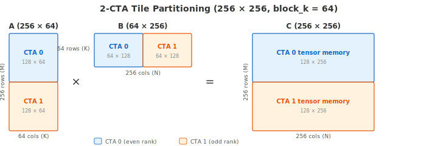

.. _tutorial_blackwell_matmul_v6:

6. 2-CTA Cluster
=================

V5 is a persistent kernel with a pipelined epilogue, but each CTA works alone
--- it loads the full A and B tiles into its own shared memory, and its tensor
core computes the full output tile.

To push performance further, we want **larger tiles**: a bigger output tile
means more compute per tile, better amortization of pipeline overhead, and
higher tensor core utilization. But shared memory per SM is limited --- we
cannot simply double the tile size and expect the data to fit.

Blackwell solves this with **2-CTA clusters**: two CTAs on adjacent SMs
cooperate on a single larger output tile. Each CTA loads only **half** of the
input data into its own shared memory, and the tensor core hardware reads from
**both CTAs' shared memory** via distributed shared memory (DSMEM). The result:
double the tile size with the same shared memory budget per SM.

In V6, the output tile grows from 128 × 256 to **256 × 256**, and the kernel
uses ``self.attrs.cluster_blocks=2``. This tutorial explains how the data is partitioned,
how the 2-CTA MMA instruction works, and what changes in the kernel code.

The Full Kernel
---------------

.. literalinclude:: ../../../../examples/blackwell_matmul/matmul_v6.py
   :language: python
   :start-at: class Pipeline
   :end-at: self.tcgen05.dealloc(t_acc)
   :caption: BlackwellMatmulV6 --- full kernel (including Pipeline class)

What Changed from V5
--------------------

.. list-table::
   :header-rows: 1
   :widths: 15 40 40

   * -
     - V5
     - V6
   * - **Cluster size**
     - 1 CTA
     - 2-CTA cluster (``cluster_blocks=2``)
   * - **Tile size**
     - 128 × 256
     - 256 × 256 (doubled M)
   * - **Shared memory per CTA**
     - Full tile: ``[block_m, block_k]`` and ``[block_n, block_k]``
     - Half tile: ``[block_m/2, block_k]`` and ``[block_n/2, block_k]``
   * - **MMA**
     - ``cta_group=1`` (implicit): single CTA's shared memory
     - ``cta_group=2``: reads both CTAs' shared memory via DSMEM
   * - **Who issues MMA**
     - MMA warp on every CTA
     - MMA warp on **CTA 0 only**
   * - **CLC**
     - ``try_cancel(multicast=False)``
     - ``try_cancel(multicast=True)``: response multicast to both CTAs
   * - **Barrier scope**
     - CTA-local
     - Cluster-scoped: ``arrive_and_expect_tx_remote``, ``arrive_and_expect_tx_multicast``
   * - **New instructions**
     -
     - :meth:`~tilus.lang.instructions.cluster.BlockClusterInstructionGroup.map_shared_addr`,
       :meth:`~tilus.lang.instructions.mbarrier.BarrierInstructionGroup.arrive_and_expect_tx_remote`,
       :meth:`~tilus.lang.instructions.mbarrier.BarrierInstructionGroup.arrive_and_expect_tx_multicast`,
       :meth:`~tilus.lang.instructions.cluster.BlockClusterInstructionGroup.sync`

.. |rarr| unicode:: U+2192

Tile Partitioning
-----------------

The cluster computes a **256 × 256** output tile (``block_m × block_n``). Note
that these dimensions are the cluster-level tile size; each CTA is responsible
for only half. The three matrices are partitioned as follows:

- **A** (256 × K): split by **rows**. CTA 0 loads the top 128 rows, CTA 1
  loads the bottom 128 rows. Each CTA stores its half in local shared memory.
- **B** (K × 256): split by **columns**. CTA 0 loads the left 128 columns,
  CTA 1 loads the right 128 columns. Each CTA stores its half in local shared
  memory.
- **C** (256 × 256): split by **rows** (same as A). CTA 0 owns rows 0--127
  in its tensor memory, CTA 1 owns rows 128--255.

   Data partitioning for a 256 × 256 output tile with ``block_k=64``.
   Each CTA holds half of A (by rows) and half of B (by columns) in shared
   memory.

The key insight is the **B sharing**. To compute ``C = A × B``, every row of A
must be multiplied against the *full* B tile. In a single-CTA kernel, each CTA
would need all of B in its shared memory. With a 2-CTA cluster, the tensor core
on each SM reads its local half of B and receives the other half from the peer
SM via **Distributed Shared Memory (DSMEM)**.

DSMEM is a Blackwell hardware feature that allows one SM to directly read
another SM's shared memory within a cluster, without going through global
memory. The hardware manages the cross-SM data transfer transparently --- from
the tensor core's perspective, it simply reads B from two shared memory
addresses, one local and one remote.

Each CTA only needs to load and store **half
of B** in shared memory, yet both CTAs compute against the full B tile. This
effectively halves the shared memory bandwidth pressure for B.

How does the hardware know to read B from both CTAs? That is what
``cta_group=2`` tells the MMA instruction.

2-CTA MMA (``cta_group=2``)
----------------------------

In V5, each CTA independently allocates tensor memory and issues MMA
instructions against its own shared memory. In V6, passing ``cta_group=2``
tells the tensor core to operate across both CTAs in the cluster:

.. code-block:: python

   # Allocation: cta_group=2 is required when MMA uses cta_group=2
   t_acc = self.tcgen05.alloc(
       dtype=float32, shape=[mma_stages, block_m // 2, block_n], cta_group=2
   )

   # MMA: the CTA pair collaborates on this MMA when cta_group=2
   self.tcgen05.mma(s_a[stage], s_b[stage].transpose(), t_acc[stage],
                     enable_input_d=..., cta_group=2)

With ``cta_group=2``:

- :meth:`tcgen05.alloc() <tilus.lang.instructions.tcgen05.Tcgen05InstructionGroup.alloc>`
  allocates tensor memory on each CTA locally. The ``cta_group=2`` flag is
  required when the accumulator will be used with 2-CTA MMA.
- :meth:`tcgen05.mma() <tilus.lang.instructions.tcgen05.Tcgen05InstructionGroup.mma>`
  is issued by **a single warp from either CTA** in the pair. The tensor core
  reads both A and B distributed across **both CTAs' shared memory** (via DSMEM),
  and writes results to both CTAs' tensor memory. In this kernel, we choose CTA 0
  as the issuer.
- :meth:`tcgen05.commit() <tilus.lang.instructions.tcgen05.Tcgen05InstructionGroup.commit>`
  with ``cta_group=2`` and ``multicast_mask=0b11`` signals barriers on **both**
  CTAs when the MMA completes.

Because only CTA 0 issues MMA, CTA 1's MMA warp is idle during the K-loop and
only participates in consuming CLC responses. With ``cta_group=2``, a single
warp from either CTA issues the MMA instruction, and the tensor core reads both
A and B distributed across both CTAs' shared memory. The single MMA produces
results for both CTAs' tensor memory.

With two CTAs sharing the same pipeline, barrier operations can no longer be
CTA-local --- they need cluster scope.

Cluster Barrier Management
--------------------------

The main changes from V5:

**TMA barriers**: CTA 0 owns the ``tma_pipe`` barriers. CTA 1 needs to arrive
on the same barrier so that CTA 0 knows when *both* CTAs' TMA loads have
completed. To do this, CTA 1 translates CTA 0's barrier address into a
cluster-visible address using
:meth:`cluster.map_shared_addr() <tilus.lang.instructions.cluster.BlockClusterInstructionGroup.map_shared_addr>`.
This instruction takes a local shared memory address and returns the equivalent
address on another CTA's SM, allowing cross-CTA barrier operations:

.. literalinclude:: ../../../../examples/blackwell_matmul/matmul_v6.py
   :language: python
   :start-at: mbarrier = tma_pipe.producer_barrier()
   :end-at: cta_group=2,
   :dedent: 20
   :caption: TMA barrier management: CTA 0 owns, CTA 1 maps remotely

CTA 0 declares the expected bytes via
:meth:`~tilus.lang.instructions.mbarrier.BarrierInstructionGroup.arrive_and_expect_tx`
(both CTAs' loads combined: ``(s_a.nbytes + s_b.nbytes) * 2``). CTA 1 maps the
barrier address to CTA 0's shared memory, so both CTAs'
:meth:`tma.global_to_shared() <tilus.lang.instructions.tma.TmaInstructionGroup.global_to_shared>`
loads signal the same barrier.

**CLC barriers**: the scheduler only runs on CTA 0. It uses
:meth:`~tilus.lang.instructions.mbarrier.BarrierInstructionGroup.arrive_and_expect_tx_multicast`
to declare expected bytes on the barriers at the same local shared memory offset
across both CTAs simultaneously --- more efficient than arriving on each CTA's
barrier separately. The CLC response is multicast to both CTAs via
:meth:`clc.try_cancel(multicast=True) <tilus.lang.instructions.clc.ClusterLaunchControlInstructionGroup.try_cancel>`,
which writes the 16-byte response to the same local shared memory offset on both
CTAs in a single operation.

.. note::

   CLC cancels an entire **cluster**, not a single CTA. The returned
   ``blockIdx`` is the index of the **first block** in the cancelled cluster.
   That is why the kernel uses ``blockIdx.x // 2`` to compute tile coordinates
   --- two consecutive block indices belong to the same cluster and map to the
   same output tile.

**Consumer arrivals**: when consuming CLC responses, each CTA arrives on
CTA 0's barrier remotely using
:meth:`~tilus.lang.instructions.mbarrier.BarrierInstructionGroup.arrive_and_expect_tx_remote`
with ``target_rank=0`` and ``scope="cluster"``. This instruction arrives on a
barrier at the same local shared memory offset in the target CTA.

Walkthrough
-----------

With the partitioning, MMA, and barrier changes in mind, let us walk through
the kernel code.

Setup
~~~~~

.. literalinclude:: ../../../../examples/blackwell_matmul/matmul_v6.py
   :language: python
   :start-at: num_m_blocks = cdiv
   :end-at: self.cluster.sync()
   :dedent: 8
   :caption: Kernel setup

Key differences from V5:

- ``blocks = num_m_blocks * num_n_blocks * 2``: two CTAs per output tile.
- ``cluster_blocks = 2``: declares the 2-CTA cluster.
- ``s_a`` and ``s_b`` are half-sized (``block_m // 2``, ``block_n // 2``).
- ``t_acc`` uses ``cta_group=2`` for distributed tensor memory.
- ``clc_pipe`` has ``consumer_arrive_count = 224 * 2`` (both CTAs' warps).
- ``cta_rank = self.cluster.blockRank`` identifies each CTA's role.
- :meth:`cluster.sync() <tilus.lang.instructions.cluster.BlockClusterInstructionGroup.sync>`
  replaces :meth:`self.sync() <tilus.lang.instructions.root.RootInstructionGroup.sync>` at kernel boundaries.

TMA Warp
~~~~~~~~

.. literalinclude:: ../../../../examples/blackwell_matmul/matmul_v6.py
   :language: python
   :start-at: with self.single_warp(0):  # tma worker
   :end-before: with self.single_warp(1):
   :dedent: 8
   :caption: TMA warp

Each CTA's TMA warp loads its own half of the data. The offset computation uses
``cta_rank`` to select the correct rows of A and columns of B. Both CTAs' TMA
loads signal CTA 0's barrier (CTA 1 maps the barrier address remotely).

MMA Warp
~~~~~~~~

.. literalinclude:: ../../../../examples/blackwell_matmul/matmul_v6.py
   :language: python
   :start-at: with self.single_warp(1):  # mma worker
   :end-before: with self.single_warp(2):
   :dedent: 8
   :caption: MMA warp

Only CTA 0 issues MMA (guarded by ``if cta_rank == 0``). The
:meth:`tcgen05.commit() <tilus.lang.instructions.tcgen05.Tcgen05InstructionGroup.commit>`
calls use ``cta_group=2, multicast_mask=0b11`` to signal barriers on both CTAs.
CTA 1's MMA warp skips the K-loop and only consumes CLC responses.

Performance
-----------

2-CTA clusters double the effective tile size via distributed MMA, matching
cuBLAS performance at ~1610 TFLOPS (~96% tensor core utilization).
The complete source is at :github:`examples/blackwell_matmul/matmul_v6.py`.

.. plot:: tutorials/matmul-blackwell/plots/plot_v6.py

   Blackwell matmul performance on B200 (M=N=K=8192, fp16). TFLOPS derived
   from NCU profiling. Peak TFLOPS estimated from cuBLAS tensor core
   utilization (96.6%).

What's Next
-----------

V6 completes the tutorial series. Starting from a minimal single-warp kernel
(V0), we progressively added TMA loads (V1), software pipelining (V2), warp
specialization (V3), tile rasterization and a pipeline abstraction (V4), CLC
persistent scheduling with a pipelined epilogue (V5), and finally 2-CTA
clusters with distributed MMA (V6). Together, these optimizations bring the
kernel to vendor-library-level performance on NVIDIA Blackwell GPUs.
